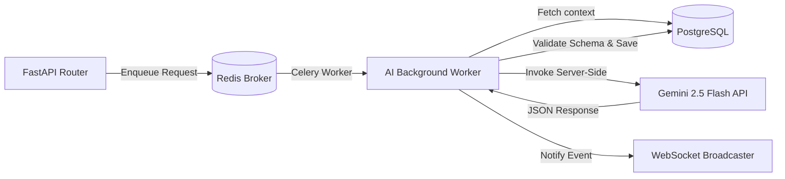

# 🦾 Enterprise Architecture: Artificial Intelligence Strategy & Integration Blueprint

## 📋 Governance & Control Metadata
- **Status**: APPROVED (Enterprise Standard)
- **Review Frequency**: Bi-annual
- **Owner**: Principal Software Architect
- **Cross References**: prediction-engine, value-betting-engine, security
- **Revision History**:
- `v1.0.0` (2026-06-29): Initial baseline AI Integration Blueprint.

---

## 🎯 1. Purpose & Objectives
Exposes how the platform structures, secures, and interacts with Artificial Intelligence services, specifically utilizing the Gemini SDK server-side.

---

## 🔍 2. Scope & Applicability
Unified reference standard across prediction, summarization, and agent workflows.

---

## 🏢 3. Structural Responsibilities
- **Responsibility**: Initialize and manage the @google/genai TypeScript client in isolated server contexts.
- **Responsibility**: Provide structured prompts, templates, and temperature bounds for consistent LLM responses.
- **Responsibility**: Abstract external LLM latency through background queues, preventing synchronous blocks.

---

## 🎨 4. Core Design Principles
- **Design Principle**: Strict Separation: Keep LLM logic entirely server-side; never expose API keys or direct SDKs to client browsers.
- **Design Principle**: Structured Outputs: Require schema validations (e.g. JSON mode or Pydantic models) for all parsed model outputs.
- **Design Principle**: Graceful Degradation: Ensure system functionality holds if an external AI API experiences downtime.

---

## 🛠️ 5. Architectural Decisions (ADR Alignment)
- **Architectural Decision**: Initialize GoogleGenAI client instances on-demand within server route contexts, leveraging process.env.GEMINI_API_KEY.
- **Architectural Decision**: Isolate all heavy intelligence processing inside Celery tasks to maintain high responsiveness on client interfaces.

---

## 📊 6. Architectural Diagrams

---

## 💡 8. Implementation Best Practices
- **Best Practice**: Utilize system instructions to lock models into safe, deterministic roles.
- **Best Practice**: Employ semantic routing layers to dispatch prompts to appropriate target models.

---

## ❌ 9. Architectural Anti-patterns
- **Anti-Pattern**: Hardcoding API keys in static files or frontend components.
- **Anti-Pattern**: Awaiting live model calls in the middle of standard real-time odds calculation loops.

---

## 🔒 10. Security & Threat Considerations
- **Boundary Controls**: Strict ingress-egress filtering and validation on all interaction pathways.
- **Identity & Access**: Zero-trust approach to internal calls and API authentication.
- **Security Posture**: API keys are stored inside Cloud Secrets and retrieved at runtime using secure container environments.

---

## ⚡ 11. Performance Considerations
- **Execution Budget**: Low-latency benchmarks targeting p95 boundaries.
- **Caching & Caching Strategy**: Read-aside cache patterns combined with transactional isolation.
- **Performance Details**: Leverages model caching and prompt optimization to keep round-trip response times <800ms.

---

## 📈 12. Scalability Considerations
- **Horizontal Scaling**: Stateless execution nodes capable of elastic growth.
- **Data Scaling**: TimescaleDB partitioning and query-read-replica isolation.
- **Scalability Details**: AI execution nodes are stateless and can scale horizontally to handle complex analysis workloads.

---

## 🧪 13. Comprehensive Testing Strategy
- **Unit Boundary Verification**: 100% logic coverage of calculations and data formats.
- **Integration & Validation Paths**: End-to-end sandbox simulations validating pipeline integrity.
- **Testing Approach**: Tested using sandbox mock responses to verify prompt outputs handle unexpected parsing targets gracefully.

---

## 🔧 14. Operational Considerations
- **Logging & Visibility**: Structured JSON logs emitted directly to log aggregation collectors.
- **Alerting thresholds**: SRE metrics integrated with Slack/Telegram escalation schedules.
- **Operational Details**: Traces prompt usage, response latency, token consumption, and rate limits dynamically.

---

## ⚠️ 15. Common Architectural Mistakes
- **Execution Mistake**: Forgetting to validate JSON schemas returned by the model, causing unhandled parsing exceptions.
- **Execution Mistake**: Flooding models with excessive context, leading to token exhaustion and elevated usage costs.

---

## 🚀 16. Continuous Future Improvements
- **Future Improvement**: Support dynamic routing across alternative model variants to optimize response speeds and costs.
- **Future Improvement**: Deploy localized vector indices to provide contextually rich prompt grounding.

---

## 🕵️ 17. Architecture Review Checklist
- [ ] **Verify**: Confirm that the Gemini API Key is never printed inside output logs.
- [ ] **Verify**: Verify that all model integrations define explicit network timeouts.

---

## 🔗 18. References & Linked Resources
- [prediction-engine](prediction-engine.md)
- [value-betting-engine](value-betting-engine.md)
- [security](security.md)
