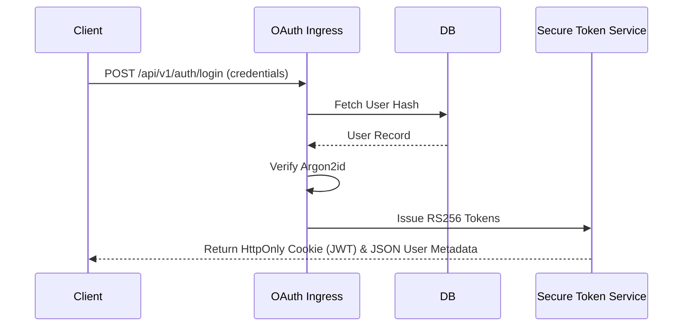

# 🦾 Enterprise Architecture: Authentication Architecture Blueprint

## 📋 Governance & Control Metadata
- **Status**: APPROVED (Enterprise Standard)
- **Review Frequency**: Bi-annual
- **Owner**: Principal Software Architect
- **Cross References**: api-architecture, authorization-architecture, disaster-recovery
- **Revision History**:
- `v1.0.0` (2026-06-29): Initial baseline Authentication specification.

---

## 🎯 1. Purpose & Objectives
Exposes how the platform validates identity, registers traders, and securely issues stateless sessions.

---

## 🔍 2. Scope & Applicability
Universal security baseline across API gateways and authorization modules.

---

## 🏢 3. Structural Responsibilities
- **Responsibility**: Enforce password hashing using high-grade hashing models.
- **Responsibility**: Issue and verify stateless JSON Web Tokens (JWT) for secure API communications.
- **Responsibility**: Support secure Google Workspace OAuth2 login pathways.

---

## 🎨 4. Core Design Principles
- **Design Principle**: Zero Trust: Every incoming request must prove authentication claims; assume zero persistent trust.
- **Design Principle**: Stateless Verification: Authenticate requests using decentralized cryptography, avoiding active DB hits.

---

## 🛠️ 5. Architectural Decisions (ADR Alignment)
- **Architectural Decision**: Hash passwords using Argon2id with strict parameters (m=65536, t=3, p=4).
- **Architectural Decision**: Store JWT tokens inside HTTP-only, SameSite=Strict cookies to protect against CSRF and XSS.

---

## 📊 6. Architectural Diagrams

---

## 💡 8. Implementation Best Practices
- **Best Practice**: Implement short token expiration limits (15 minutes) alongside secure, rotating refresh tokens.
- **Best Practice**: Enforce multi-factor authentication (MFA) for administrative and portfolio actions.

---

## ❌ 9. Architectural Anti-patterns
- **Anti-Pattern**: Storing authentication tokens inside client-side LocalStorage.
- **Anti-Pattern**: Committing raw JWT keys or secrets inside git source code files.

---

## 🔒 10. Security & Threat Considerations
- **Boundary Controls**: Strict ingress-egress filtering and validation on all interaction pathways.
- **Identity & Access**: Zero-trust approach to internal calls and API authentication.
- **Security Posture**: Tokens are verified using asymmetric RS256 keys. Session validation handles IP address changes dynamically.

---

## ⚡ 11. Performance Considerations
- **Execution Budget**: Low-latency benchmarks targeting p95 boundaries.
- **Caching & Caching Strategy**: Read-aside cache patterns combined with transactional isolation.
- **Performance Details**: JWT checks execute in-memory inside the API Gateway, adding less than 1ms to API calls.

---

## 📈 12. Scalability Considerations
- **Horizontal Scaling**: Stateless execution nodes capable of elastic growth.
- **Data Scaling**: TimescaleDB partitioning and query-read-replica isolation.
- **Scalability Details**: Because sessions are stateless, any API node can instantly authenticate requests without checking database states.

---

## 🧪 13. Comprehensive Testing Strategy
- **Unit Boundary Verification**: 100% logic coverage of calculations and data formats.
- **Integration & Validation Paths**: End-to-end sandbox simulations validating pipeline integrity.
- **Testing Approach**: Tested using simulated token lifecycles, asserting that invalid, expired, or tampered tokens are rejected.

---

## 🔧 14. Operational Considerations
- **Logging & Visibility**: Structured JSON logs emitted directly to log aggregation collectors.
- **Alerting thresholds**: SRE metrics integrated with Slack/Telegram escalation schedules.
- **Operational Details**: Authentication systems log login attempts, IP geography shifts, and session revocation rates.

---

## ⚠️ 15. Common Architectural Mistakes
- **Execution Mistake**: Using weak MD5 or SHA256 hashes to store user credentials.
- **Execution Mistake**: Omitting CORS protections on authentication endpoints, allowing unauthorized cross-origin requests.

---

## 🚀 16. Continuous Future Improvements
- **Future Improvement**: Transition authentication systems to standard passkey (WebAuthn) passwordless access.
- **Future Improvement**: Integrate real-time anomaly detection identifying automated login attacks.

---

## 🕵️ 17. Architecture Review Checklist
- [ ] **Verify**: Confirm passwords are never logged in plain-text inside debug files.
- [ ] **Verify**: Verify JWT keys are loaded strictly from secure Cloud Secrets storage.

---

## 🔗 18. References & Linked Resources
- [api-architecture](api-architecture.md)
- [authorization-architecture](authorization-architecture.md)
- [disaster-recovery](disaster-recovery.md)
