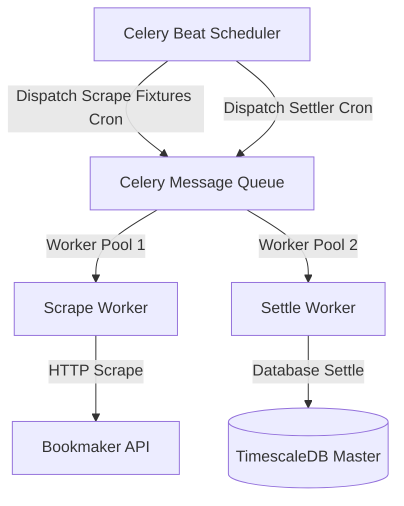

# 🦾 Enterprise Architecture: Continuous Automation Pipeline & Agent Lifecycle

## 📋 Governance & Control Metadata
- **Status**: APPROVED (Enterprise Standard)
- **Review Frequency**: Bi-annual
- **Owner**: Principal Software Architect
- **Cross References**: system-overview, module-interactions, event-driven
- **Revision History**:
- `v1.0.0` (2026-06-29): Initial baseline Automation specification.

---

## 🎯 1. Purpose & Objectives
Exposes how the platform structures background automation pipelines, scheduling intervals, and autonomous agent loops.

---

## 🔍 2. Scope & Applicability
Universal guide for developers building background scrapers, checkers, and scheduler tasks.

---

## 🏢 3. Structural Responsibilities
- **Responsibility**: Configure Celery Beat scheduling intervals across all cron-style operations.
- **Responsibility**: Ensure scrapers and settlement checkers run in separate, non-overlapping task pools.
- **Responsibility**: Manage agent workspaces and ensure safe concurrent execution bounds.

---

## 🎨 4. Core Design Principles
- **Design Principle**: Task Idempotency: All tasks must be safe to rerun; duplicates should cause no data anomalies.
- **Design Principle**: Strict Isolation: Keep task states decoupled; a failing scraping task must never halt the primary API gateway.

---

## 🛠️ 5. Architectural Decisions (ADR Alignment)
- **Architectural Decision**: Deploy Celery Beat to manage unified task scheduling.
- **Architectural Decision**: Utilize Redis distributed locks to prevent multiple worker nodes from scraping identical bookmaker endpoints concurrently.

---

## 📊 6. Architectural Diagrams

---

## 💡 8. Implementation Best Practices
- **Best Practice**: Incorporate retry policies with exponential backoff on all network-intensive tasks.
- **Best Practice**: Log automation loop start and stop states with unique run IDs to track performance.

---

## ❌ 9. Architectural Anti-patterns
- **Anti-Pattern**: Running heavy analysis loops inside the main API process thread.
- **Anti-Pattern**: Designing background tasks that run infinitely without built-in timeouts.

---

## 🔒 10. Security & Threat Considerations
- **Boundary Controls**: Strict ingress-egress filtering and validation on all interaction pathways.
- **Identity & Access**: Zero-trust approach to internal calls and API authentication.
- **Security Posture**: Tasks are executed under non-privileged system service accounts, restricting unauthorized system access.

---

## ⚡ 11. Performance Considerations
- **Execution Budget**: Low-latency benchmarks targeting p95 boundaries.
- **Caching & Caching Strategy**: Read-aside cache patterns combined with transactional isolation.
- **Performance Details**: Redis locks prevent redundant calculations, keeping background CPU loads below 30%.

---

## 📈 12. Scalability Considerations
- **Horizontal Scaling**: Stateless execution nodes capable of elastic growth.
- **Data Scaling**: TimescaleDB partitioning and query-read-replica isolation.
- **Scalability Details**: Worker containers scale elastically based on outstanding message backlogs.

---

## 🧪 13. Comprehensive Testing Strategy
- **Unit Boundary Verification**: 100% logic coverage of calculations and data formats.
- **Integration & Validation Paths**: End-to-end sandbox simulations validating pipeline integrity.
- **Testing Approach**: Tested using mock task schedules, verifying correct execution sequences and error recovery loops.

---

## 🔧 14. Operational Considerations
- **Logging & Visibility**: Structured JSON logs emitted directly to log aggregation collectors.
- **Alerting thresholds**: SRE metrics integrated with Slack/Telegram escalation schedules.
- **Operational Details**: Operational metrics monitor task duration, queue backlog, lock collision counts, and error rates.

---

## ⚠️ 15. Common Architectural Mistakes
- **Execution Mistake**: Omitting lock timeouts, causing pipelines to halt indefinitely if a worker container crashes during an active scrape.
- **Execution Mistake**: Using identical queues for high-priority alerts and low-priority historical scraping.

---

## 🚀 16. Continuous Future Improvements
- **Future Improvement**: Transition key scheduling queues to highly resilient distributed brokers.
- **Future Improvement**: Support dynamic task interval configurations through administrative consoles.

---

## 🕵️ 17. Architecture Review Checklist
- [ ] **Verify**: Verify that all scheduled tasks declare explicit maximum execution timeouts.
- [ ] **Verify**: Confirm that scraping worker tasks utilize proxy rotation to avoid rate limits.

---

## 🔗 18. References & Linked Resources
- [system-overview](system-overview.md)
- [module-interactions](module-interactions.md)
- [event-driven](event-driven.md)
