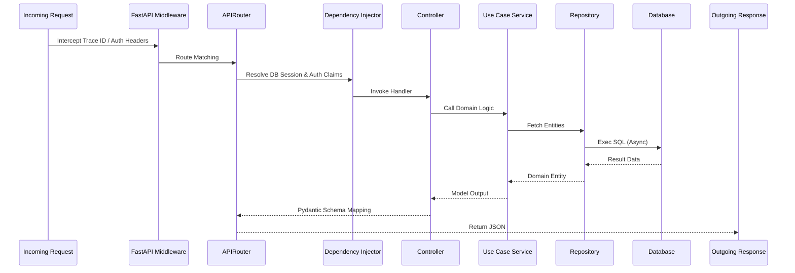

# 🦾 Enterprise Architecture: Backend Architecture Specification

## 📋 Governance & Control Metadata
- **Status**: APPROVED (Enterprise Standard)
- **Review Frequency**: Bi-annual
- **Owner**: Principal Software Architect
- **Cross References**: clean-architecture, api-architecture, database-architecture
- **Revision History**:
- `v1.0.0` (2026-06-29): Initial baseline Backend blueprint.

---

## 🎯 1. Purpose & Objectives
Provides detailed instructions on Python FastAPI backend structure, layers, dependency injection, and request lifecycles.

---

## 🔍 2. Scope & Applicability
Standard backend blueprint for all engineers developing core platform services.

---

## 🏢 3. Structural Responsibilities
- **Responsibility**: Expose backend layout (Routers -> Use Cases -> Services -> Repositories -> Models).
- **Responsibility**: Detail asynchronous database session management and dependency injection rules.
- **Responsibility**: Outline background processing pipelines using Redis and Celery queues.

---

## 🎨 4. Core Design Principles
- **Design Principle**: Asynchronous First: Use async/await syntax for all IO-bound network, cache, or database calls.
- **Design Principle**: Strict Schema Validation: Use Pydantic V2 models to validate all API request-response boundaries.
- **Design Principle**: Centralized Exception Management: Catch and map exceptions in custom middleware.

---

## 🛠️ 5. Architectural Decisions (ADR Alignment)
- **Architectural Decision**: Adopt SQLAlchemy 2.0 Async Session Managers for high-performance concurrent DB pooling.
- **Architectural Decision**: Resolve controller dependencies via FastAPI Depends structures to keep classes mockable.

---

## 📊 6. Architectural Diagrams

### ⚙️ FastAPI Request Lifecycle

---

## 💡 8. Implementation Best Practices
- **Best Practice**: Implement structured JSON logging using structlog across all routers and workers.
- **Best Practice**: Limit task executions on Celery to prevent memory bloating over long runtimes.

---

## ❌ 9. Architectural Anti-patterns
- **Anti-Pattern**: Utilizing blocking synchronous libraries (e.g., requests) inside async endpoint definitions.
- **Anti-Pattern**: Hardcoding connection pools or DB secrets within router files.

---

## 🔒 10. Security & Threat Considerations
- **Boundary Controls**: Strict ingress-egress filtering and validation on all interaction pathways.
- **Identity & Access**: Zero-trust approach to internal calls and API authentication.
- **Security Posture**: SQLAlchemy ORM automatically parameterizes all queries, preventing SQL injection exploits. Password hashing uses Argon2id.

---

## ⚡ 11. Performance Considerations
- **Execution Budget**: Low-latency benchmarks targeting p95 boundaries.
- **Caching & Caching Strategy**: Read-aside cache patterns combined with transactional isolation.
- **Performance Details**: Leverages UVicorn and Asyncio loops, routinely maintaining API response latencies below 45ms.

---

## 📈 12. Scalability Considerations
- **Horizontal Scaling**: Stateless execution nodes capable of elastic growth.
- **Data Scaling**: TimescaleDB partitioning and query-read-replica isolation.
- **Scalability Details**: API gateways are stateless, allowing simple scaling using auto-scaling Cloud Run clusters.

---

## 🧪 13. Comprehensive Testing Strategy
- **Unit Boundary Verification**: 100% logic coverage of calculations and data formats.
- **Integration & Validation Paths**: End-to-end sandbox simulations validating pipeline integrity.
- **Testing Approach**: Fully tested using Pytest, utilizing async test clients and transactional test DB rollback rollouts.

---

## 🔧 14. Operational Considerations
- **Logging & Visibility**: Structured JSON logs emitted directly to log aggregation collectors.
- **Alerting thresholds**: SRE metrics integrated with Slack/Telegram escalation schedules.
- **Operational Details**: Integrates Prometheus instrumentation to track API endpoints execution speeds, error counts, and DB connection states.

---

## ⚠️ 15. Common Architectural Mistakes
- **Execution Mistake**: Using un-awaited database queries, leading to silent failures and dangling session locks.
- **Execution Mistake**: Forgetting to configure CORS origins properly, blocking legitimate frontend clients.

---

## 🚀 16. Continuous Future Improvements
- **Future Improvement**: Integrate automatic API query profiling to log slow database transactions.
- **Future Improvement**: Optimize FastAPI routing tables using static compiled routing modules.

---

## 🕵️ 17. Architecture Review Checklist
- [ ] **Verify**: Confirm all database session calls are enclosed inside async context manager blocks.
- [ ] **Verify**: Verify that all Pydantic schemas include explicit type annotations and field descriptions.

---

## 🔗 18. References & Linked Resources
- [clean-architecture](clean-architecture.md)
- [api-architecture](api-architecture.md)
- [database-architecture](database-architecture.md)
