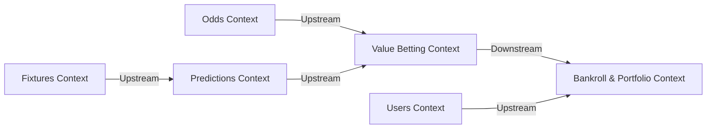

# 🦾 Enterprise Architecture: Bounded Contexts Specification

## 📋 Governance & Control Metadata
- **Status**: APPROVED (Enterprise Standard)
- **Review Frequency**: Bi-annual
- **Owner**: Principal Software Architect
- **Cross References**: domain-driven-design, module-interactions, dependency-graph
- **Revision History**:
- `v1.0.0` (2026-06-29): Initial baseline Bounded Context specification.

---

## 🎯 1. Purpose & Objectives
Exposes boundaries, interfaces, and database ownership rules for every domain context in the platform.

---

## 🔍 2. Scope & Applicability
Enforced across all development microservices and engineering teams.

---

## 🏢 3. Structural Responsibilities
- **Responsibility**: Establish explicit boundaries for contexts (Fixtures, Predictions, Odds, Users, Bankroll, ML, etc.).
- **Responsibility**: Prevent model pollution by isolating vocabulary definitions within contexts.
- **Responsibility**: Define clear API contracts and asynchronous event triggers between contexts.

---

## 🎨 4. Core Design Principles
- **Design Principle**: Database Ownership: A bounded context must own its schema; other contexts can only access its data via public APIs.
- **Design Principle**: Loose Coupling: Communicate exclusively via REST endpoints, WebSockets, or published events.

---

## 🛠️ 5. Architectural Decisions (ADR Alignment)
- **Architectural Decision**: Segment the database into schemas/namespaces matching bounded contexts.
- **Architectural Decision**: Use a Shared Kernel strictly for shared utility helper files and common type definitions.

---

## 📊 6. Architectural Diagrams

---

## 💡 8. Implementation Best Practices
- **Best Practice**: Define explicit translation adapters (Anti-Corruption Layers) when interacting with external supplier feeds.
- **Best Practice**: Maintain an up-to-date Context Map diagram mapping upstream-downstream relationships.

---

## ❌ 9. Architectural Anti-patterns
- **Anti-Pattern**: Shared Database tables modified by multiple independent bounded contexts.
- **Anti-Pattern**: Direct imports of classes or services across isolated context folders.

---

## 🔒 10. Security & Threat Considerations
- **Boundary Controls**: Strict ingress-egress filtering and validation on all interaction pathways.
- **Identity & Access**: Zero-trust approach to internal calls and API authentication.
- **Security Posture**: Context isolation limits security breaches; compromising the notifications context cannot compromise user wallets or credentials.

---

## ⚡ 11. Performance Considerations
- **Execution Budget**: Low-latency benchmarks targeting p95 boundaries.
- **Caching & Caching Strategy**: Read-aside cache patterns combined with transactional isolation.
- **Performance Details**: Optimizes database query performance by keeping schemas specialized and normalized within contexts.

---

## 📈 12. Scalability Considerations
- **Horizontal Scaling**: Stateless execution nodes capable of elastic growth.
- **Data Scaling**: TimescaleDB partitioning and query-read-replica isolation.
- **Scalability Details**: Allows containerization of specific contexts (e.g. Scrapers and Odds Ingestion) to handle peak load spikes.

---

## 🧪 13. Comprehensive Testing Strategy
- **Unit Boundary Verification**: 100% logic coverage of calculations and data formats.
- **Integration & Validation Paths**: End-to-end sandbox simulations validating pipeline integrity.
- **Testing Approach**: Allows mocking entire external contexts, enabling rapid localized context testing.

---

## 🔧 14. Operational Considerations
- **Logging & Visibility**: Structured JSON logs emitted directly to log aggregation collectors.
- **Alerting thresholds**: SRE metrics integrated with Slack/Telegram escalation schedules.
- **Operational Details**: Easily isolate memory or CPU leaks to specific bounded context runtimes.

---

## ⚠️ 15. Common Architectural Mistakes
- **Execution Mistake**: Confusing the "Odds Ingestion" context model of odds with the "Value Engine" odds representations.
- **Execution Mistake**: Creating dense direct synchronous call chains across contexts, leading to cascading failures.

---

## 🚀 16. Continuous Future Improvements
- **Future Improvement**: Implement OpenAPI contracts matching each context boundary to enable strict API gateway validation.
- **Future Improvement**: Transition inter-context communications to Kafka or RabbitMQ as team sizes grow.

---

## 🕵️ 17. Architecture Review Checklist
- [ ] **Verify**: Verify that zero tables are modified by more than a single bounded context service.
- [ ] **Verify**: Confirm that all inter-context REST calls utilize authenticated communication tokens.

---

## 🔗 18. References & Linked Resources
- [domain-driven-design](domain-driven-design.md)
- [module-interactions](module-interactions.md)
- [dependency-graph](dependency-graph.md)
