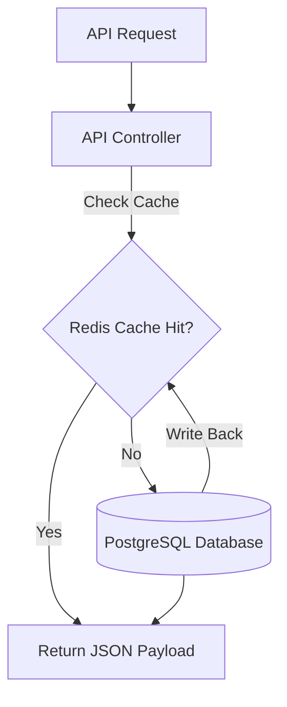

# 🦾 Enterprise Architecture: Caching & Data Pre-warming Architecture

## 📋 Governance & Control Metadata
- **Status**: APPROVED (Enterprise Standard)
- **Review Frequency**: Bi-annual
- **Owner**: Principal Software Architect
- **Cross References**: backend-architecture, database-architecture, monitoring
- **Revision History**:
- `v1.0.0` (2026-06-29): Initial baseline Caching specification.

---

## 🎯 1. Purpose & Objectives
Exposes the multi-tier caching standard used to maximize throughput and limit database locks.

---

## 🔍 2. Scope & Applicability
Universal caching standard across API gateways, workers, and scrapers.

---

## 🏢 3. Structural Responsibilities
- **Responsibility**: Minimize database CPU loads by caching high-frequency static datasets.
- **Responsibility**: Manage Redis cache-aside, write-through, and cache-invalidation flows.
- **Responsibility**: Pre-warm critical data pools (odds tables, team indices) on regular schedules.

---

## 🎨 4. Core Design Principles
- **Design Principle**: Validate Cache Invalidation: A cache without a robust invalidation rule is a critical system vulnerability.
- **Design Principle**: Data Locality: Store hot static resources closest to the execution point.

---

## 🛠️ 5. Architectural Decisions (ADR Alignment)
- **Architectural Decision**: Deploy Redis as the centralized distributed caching cluster.
- **Architectural Decision**: Set strict, automated Time-To-Live (TTL) limits on all cached keys.

---

## 📊 6. Architectural Diagrams

---

## 💡 8. Implementation Best Practices
- **Best Practice**: Use structured JSON strings for cached values to preserve model representations.
- **Best Practice**: Implement a fallback circuit breaker: if Redis drops, route requests directly to the database without crashing the client.

---

## ❌ 9. Architectural Anti-patterns
- **Anti-Pattern**: Caching high-frequency timeseries data without checking memory consumption limits.
- **Anti-Pattern**: Forgetting to invalidate cached odds when a match gets postponed or canceled.

---

## 🔒 10. Security & Threat Considerations
- **Boundary Controls**: Strict ingress-egress filtering and validation on all interaction pathways.
- **Identity & Access**: Zero-trust approach to internal calls and API authentication.
- **Security Posture**: Redis connections are fully encrypted (TLS) and require strong password credentials.

---

## ⚡ 11. Performance Considerations
- **Execution Budget**: Low-latency benchmarks targeting p95 boundaries.
- **Caching & Caching Strategy**: Read-aside cache patterns combined with transactional isolation.
- **Performance Details**: Reduces hot endpoint response latencies to <5ms, bypassing heavy database queries.

---

## 📈 12. Scalability Considerations
- **Horizontal Scaling**: Stateless execution nodes capable of elastic growth.
- **Data Scaling**: TimescaleDB partitioning and query-read-replica isolation.
- **Scalability Details**: Reduces database read-replica CPU consumption, freeing resources for write operations.

---

## 🧪 13. Comprehensive Testing Strategy
- **Unit Boundary Verification**: 100% logic coverage of calculations and data formats.
- **Integration & Validation Paths**: End-to-end sandbox simulations validating pipeline integrity.
- **Testing Approach**: Tested by evaluating API outputs before and after invalidation events to confirm correct freshness.

---

## 🔧 14. Operational Considerations
- **Logging & Visibility**: Structured JSON logs emitted directly to log aggregation collectors.
- **Alerting thresholds**: SRE metrics integrated with Slack/Telegram escalation schedules.
- **Operational Details**: Monitors Redis cache hit/miss ratios, total memory footprint, and network loads.

---

## ⚠️ 15. Common Architectural Mistakes
- **Execution Mistake**: Using the same Redis instance for caching, Celery task broker, and WebSockets without isolating database IDs.
- **Execution Mistake**: Failing to handle cache stampedes on hot match cards.

---

## 🚀 16. Continuous Future Improvements
- **Future Improvement**: Deploy localized in-memory caches (like lru-cache) alongside distributed Redis layers.
- **Future Improvement**: Configure auto-scaling Redis clusters to dynamically handle traffic peaks.

---

## 🕵️ 17. Architecture Review Checklist
- [ ] **Verify**: Confirm all cache keys have explicit, finite TTL parameters.
- [ ] **Verify**: Verify that cache bypass options are supported for development and troubleshooting.

---

## 🔗 18. References & Linked Resources
- [backend-architecture](backend-architecture.md)
- [database-architecture](database-architecture.md)
- [monitoring](monitoring.md)
