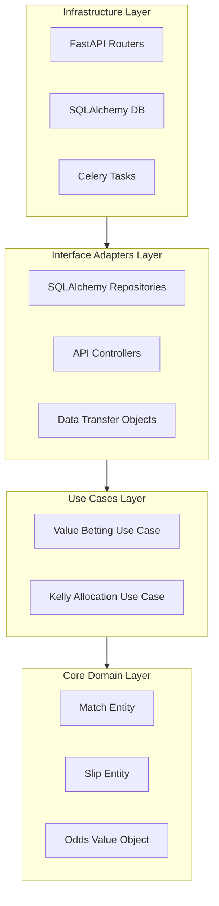

# 🦾 Enterprise Architecture: Clean Architecture Blueprint

## 📋 Governance & Control Metadata
- **Status**: APPROVED (Enterprise Standard)
- **Review Frequency**: Bi-annual
- **Owner**: Principal Software Architect
- **Cross References**: system-overview, domain-driven-design, bounded-contexts
- **Revision History**:
- `v1.0.0` (2026-06-29): Created clean architecture layout standard.

---

## 🎯 1. Purpose & Objectives
Defines the enterprise layer boundaries and structural rules governing dependencies across the platform.

---

## 🔍 2. Scope & Applicability
Enforced across both Python FastAPI backend and React Vite frontend modules.

---

## 🏢 3. Structural Responsibilities
- **Responsibility**: Isolate pure business logic (Entities) from frameworks, databases, and network adapters.
- **Responsibility**: Enforce the inward-only dependency rule: outer layers depend on inner layers, never vice-versa.
- **Responsibility**: Provide decoupled interface adapters for easy replacement of DB, API, or visual layers.

---

## 🎨 4. Core Design Principles
- **Design Principle**: Framework Independence: The core domain does not know about FastAPI, Celery, or React.
- **Design Principle**: Database Independence: All storage operations use interface abstractions (Repositories).
- **Design Principle**: Testability: Use cases can be fully unit-tested in isolation without real DB or network connections.

---

## 🛠️ 5. Architectural Decisions (ADR Alignment)
- **Architectural Decision**: Model domains using clean concentric circles: Entities -> Use Cases -> Adapters -> Infrastructure.
- **Architectural Decision**: Use dependency injection containers (FastAPI Depends) to resolve repository dependencies at runtime.

---

## 📊 6. Architectural Diagrams

---

## 💡 8. Implementation Best Practices
- **Best Practice**: Never pass raw DB models (SQLAlchemy) past the Repository boundary; map them to pure Domain Entities.
- **Best Practice**: Declare custom exceptions inside the Use Case layer, allowing API routers to catch and map them to HTTP responses.

---

## ❌ 9. Architectural Anti-patterns
- **Anti-Pattern**: Importing FastAPI or SQLAlchemy inside pure business logic classes.
- **Anti-Pattern**: Accessing the database directly from UI controllers or endpoints.

---

## 🔒 10. Security & Threat Considerations
- **Boundary Controls**: Strict ingress-egress filtering and validation on all interaction pathways.
- **Identity & Access**: Zero-trust approach to internal calls and API authentication.
- **Security Posture**: Isolating pure domain rules from infrastructure prevents security vulnerabilities like SQL injections from accessing domain invariants.

---

## ⚡ 11. Performance Considerations
- **Execution Budget**: Low-latency benchmarks targeting p95 boundaries.
- **Caching & Caching Strategy**: Read-aside cache patterns combined with transactional isolation.
- **Performance Details**: Extremely thin layers with zero framework overhead, facilitating high-speed compiled execution.

---

## 📈 12. Scalability Considerations
- **Horizontal Scaling**: Stateless execution nodes capable of elastic growth.
- **Data Scaling**: TimescaleDB partitioning and query-read-replica isolation.
- **Scalability Details**: By separating layers, any single layer (e.g., scraping adapter) can scale independently of core math solvers.

---

## 🧪 13. Comprehensive Testing Strategy
- **Unit Boundary Verification**: 100% logic coverage of calculations and data formats.
- **Integration & Validation Paths**: End-to-end sandbox simulations validating pipeline integrity.
- **Testing Approach**: Highly mockable design where pure domain unit tests run instantly with zero docker or DB dependencies.

---

## 🔧 14. Operational Considerations
- **Logging & Visibility**: Structured JSON logs emitted directly to log aggregation collectors.
- **Alerting thresholds**: SRE metrics integrated with Slack/Telegram escalation schedules.
- **Operational Details**: Clear error paths trace exceptions to specific architectural layers in JSON structured console outputs.

---

## ⚠️ 15. Common Architectural Mistakes
- **Execution Mistake**: Mixing presentation logic (formatting floats) inside raw Domain calculations.
- **Execution Mistake**: Letting database-specific transaction logic bleed into high-level business use cases.

---

## 🚀 16. Continuous Future Improvements
- **Future Improvement**: Develop automatic clean architecture linting rules that block imports violating inward-only paths.
- **Future Improvement**: Introduce code generators to bootstrap new clean layers.

---

## 🕵️ 17. Architecture Review Checklist
- [ ] **Verify**: Confirm that domain files contain zero imports from sqlalchemy, fastapi, or celery.
- [ ] **Verify**: Verify that all use cases communicate with external systems strictly via interface abstractions.

---

## 🔗 18. References & Linked Resources
- [system-overview](system-overview.md)
- [domain-driven-design](domain-driven-design.md)
- [bounded-contexts](bounded-contexts.md)
