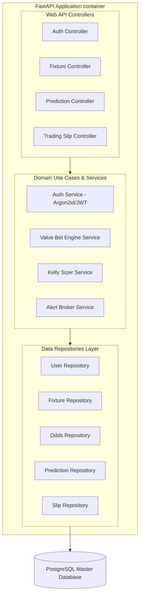
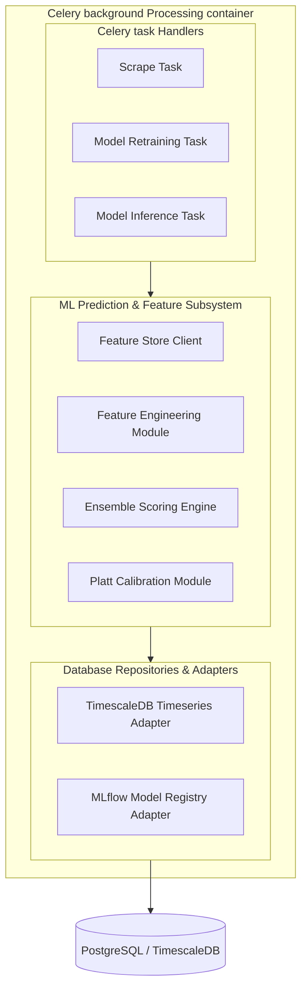

# 🦾 Enterprise Architecture: Platform Component Diagrams

## 📋 Governance & Control Metadata
- **Status**: APPROVED (Enterprise Standard)
- **Review Frequency**: Bi-annual
- **Owner**: Principal Software Architect
- **Cross References**: clean-architecture, bounded-contexts, dependency-graph
- **Revision History**:
- `v1.0.0` (2026-06-29): Initial baseline Component Diagrams released.

---

## 🎯 1. Purpose & Objectives
Exposes detailed component structures, module bounds, and dependency links within services.

---

## 🔍 2. Scope & Applicability
Universal standard for architectural component layouts.

---

## 🏢 3. Structural Responsibilities
- **Responsibility**: Detail key architectural layers (Database, Worker, API, frontend) down to individual code modules.
- **Responsibility**: Expose internal component dependency maps, preventing clean boundary bypasses.
- **Responsibility**: Serve as the onboarding blueprint for engineers modifying core platform systems.

---

## 🎨 4. Core Design Principles
- **Design Principle**: Component Isolation: Keep components modular, self-contained, and communicating via strict API interfaces.
- **Design Principle**: Single Responsibility: Each component must own a single cohesive set of business logic.

---

## 🛠️ 5. Architectural Decisions (ADR Alignment)
- **Architectural Decision**: Model architectural layouts inside Mermaid C4 component charts.
- **Architectural Decision**: Enforce directory separations aligning directly with visual component maps.

---

## 📊 6. Architectural Diagrams

### 🏗️ Backend API Core Components (C4 Component Diagram)

### 🧠 Machine Learning & Inference Components (C4 Component Diagram)

---

## 💡 8. Implementation Best Practices
- **Best Practice**: Encapsulate database access logic inside dedicated repository layers.
- **Best Practice**: Organize components hierarchically by bounded contexts.

---

## ❌ 9. Architectural Anti-patterns
- **Anti-Pattern**: Creating dense, monolithic services mixing data access, business, and visual rendering.
- **Anti-Pattern**: Allowing presentation helpers to import backend model schemas.

---

## 🔒 10. Security & Threat Considerations
- **Boundary Controls**: Strict ingress-egress filtering and validation on all interaction pathways.
- **Identity & Access**: Zero-trust approach to internal calls and API authentication.
- **Security Posture**: Validates that sensitive processing components are isolated behind internal secure networks.

---

## ⚡ 11. Performance Considerations
- **Execution Budget**: Low-latency benchmarks targeting p95 boundaries.
- **Caching & Caching Strategy**: Read-aside cache patterns combined with transactional isolation.
- **Performance Details**: Decoupled components limit computational overhead and transaction locks.

---

## 📈 12. Scalability Considerations
- **Horizontal Scaling**: Stateless execution nodes capable of elastic growth.
- **Data Scaling**: TimescaleDB partitioning and query-read-replica isolation.
- **Scalability Details**: Facilitates transition of decoupled components to independent cloud services.

---

## 🧪 13. Comprehensive Testing Strategy
- **Unit Boundary Verification**: 100% logic coverage of calculations and data formats.
- **Integration & Validation Paths**: End-to-end sandbox simulations validating pipeline integrity.
- **Testing Approach**: Supports localized module mocking, enabling faster test executions.

---

## 🔧 14. Operational Considerations
- **Logging & Visibility**: Structured JSON logs emitted directly to log aggregation collectors.
- **Alerting thresholds**: SRE metrics integrated with Slack/Telegram escalation schedules.
- **Operational Details**: Helps SREs trace performance bottlenecks to specific codebase folders.

---

## ⚠️ 15. Common Architectural Mistakes
- **Execution Mistake**: Mixing bookmaker-specific parsing details inside the general odds normalization classes.
- **Execution Mistake**: Creating circular imports across adjacent components.

---

## 🚀 16. Continuous Future Improvements
- **Future Improvement**: Deploy automated code parsing tools to generate live component maps directly from code.
- **Future Improvement**: Support dynamic configuration loads across isolated containers.

---

## 🕵️ 17. Architecture Review Checklist
- [ ] **Verify**: Confirm that the component diagram matches the active folder structure.
- [ ] **Verify**: Verify that components communicate with databases exclusively via repository layers.

---

## 🔗 18. References & Linked Resources
- [clean-architecture](clean-architecture.md)
- [bounded-contexts](bounded-contexts.md)
- [dependency-graph](dependency-graph.md)
