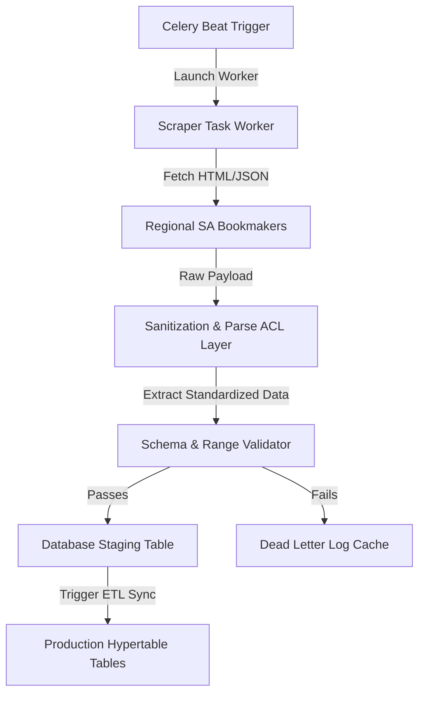

# 🦾 Enterprise Architecture: Data Ingestion & Scraper Pipeline Architecture

## 📋 Governance & Control Metadata
- **Status**: APPROVED (Enterprise Standard)
- **Review Frequency**: Bi-annual
- **Owner**: Principal Software Architect
- **Cross References**: system-overview, database-architecture, odds-provider
- **Revision History**:
- `v1.0.0` (2026-06-29): Initial baseline Data Ingestion spec.

---

## 🎯 1. Purpose & Objectives
Exposes how regional sports scrapers and historical feed providers ingest data into the database.

---

## 🔍 2. Scope & Applicability
Blueprint for data engineers and scrapper developers.

---

## 🏢 3. Structural Responsibilities
- **Responsibility**: Ingest live odds, match status updates, and results continuously from regional platforms.
- **Responsibility**: Execute robust cleaning, parsing, and data validation routines to prevent pipeline contamination.
- **Responsibility**: Enforce scraping rate limits and exponential backoff behaviors on network exceptions.

---

## 🎨 4. Core Design Principles
- **Design Principle**: Graceful Degradation: If a single scraper fails, other scrapers must continue operating.
- **Design Principle**: Politeness & Compliance: Respect robots.txt directives and limit scrapers concurrency to prevent target service disruption.
- **Design Principle**: Idempotent Writes: Ingested events must write cleanly without generating duplicate records.

---

## 🛠️ 5. Architectural Decisions (ADR Alignment)
- **Architectural Decision**: Run scrapers inside asynchronous Celery workers triggered regularly by Celery Beat scheduler tasks.
- **Architectural Decision**: Use a staging table model to store raw scraping objects before performing ETL validation checks.

---

## 📊 6. Architectural Diagrams

---

## 💡 8. Implementation Best Practices
- **Best Practice**: Implement user-agent rotation policies and dynamic proxy networks to prevent connection blocking.
- **Best Practice**: Sanitize text patterns (e.g. standardizing team names like "Man United" and "Manchester United") in adapter layers.

---

## ❌ 9. Architectural Anti-patterns
- **Anti-Pattern**: Directly writing raw, unvalidated scraper strings into production transaction tables.
- **Anti-Pattern**: Hardcoding scraper crawl intervals inside core codebase configuration modules.

---

## 🔒 10. Security & Threat Considerations
- **Boundary Controls**: Strict ingress-egress filtering and validation on all interaction pathways.
- **Identity & Access**: Zero-trust approach to internal calls and API authentication.
- **Security Posture**: Scraper credentials and target endpoints are stored securely inside Environment variables, never committed to git.

---

## ⚡ 11. Performance Considerations
- **Execution Budget**: Low-latency benchmarks targeting p95 boundaries.
- **Caching & Caching Strategy**: Read-aside cache patterns combined with transactional isolation.
- **Performance Details**: Ingestion loops utilize async requests, parsing and committing hundreds of odds ticks per second.

---

## 📈 12. Scalability Considerations
- **Horizontal Scaling**: Stateless execution nodes capable of elastic growth.
- **Data Scaling**: TimescaleDB partitioning and query-read-replica isolation.
- **Scalability Details**: Scraper tasks are distributed across elastically scaling Celery background workers, scaling easily with match count.

---

## 🧪 13. Comprehensive Testing Strategy
- **Unit Boundary Verification**: 100% logic coverage of calculations and data formats.
- **Integration & Validation Paths**: End-to-end sandbox simulations validating pipeline integrity.
- **Testing Approach**: Scrapers are tested using recorded network responses (mocked via VCR.py) to prevent hitting live endpoints in test loops.

---

## 🔧 14. Operational Considerations
- **Logging & Visibility**: Structured JSON logs emitted directly to log aggregation collectors.
- **Alerting thresholds**: SRE metrics integrated with Slack/Telegram escalation schedules.
- **Operational Details**: Emits Prometheus metrics on scraper execution runtimes, HTML parse failures, and target response codes.

---

## ⚠️ 15. Common Architectural Mistakes
- **Execution Mistake**: Failing to handle target website DOM structural changes, causing silent scraping failures.
- **Execution Mistake**: Omitting rate limiting, leading to quick server-side IP address bans.

---

## 🚀 16. Continuous Future Improvements
- **Future Improvement**: Deploy automatic AI-powered DOM parsers capable of adapting to layout adjustments.
- **Future Improvement**: Integrate real-time proxy speed auditing systems.

---

## 🕵️ 17. Architecture Review Checklist
- [ ] **Verify**: Confirm all scrapers declare a strict, non-blocking HTTP timeout limit.
- [ ] **Verify**: Verify that team name standardization dictionaries are loaded from a central schema file.

---

## 🔗 18. References & Linked Resources
- [system-overview](system-overview.md)
- [database-architecture](database-architecture.md)
- [odds-provider](odds-provider.md)
