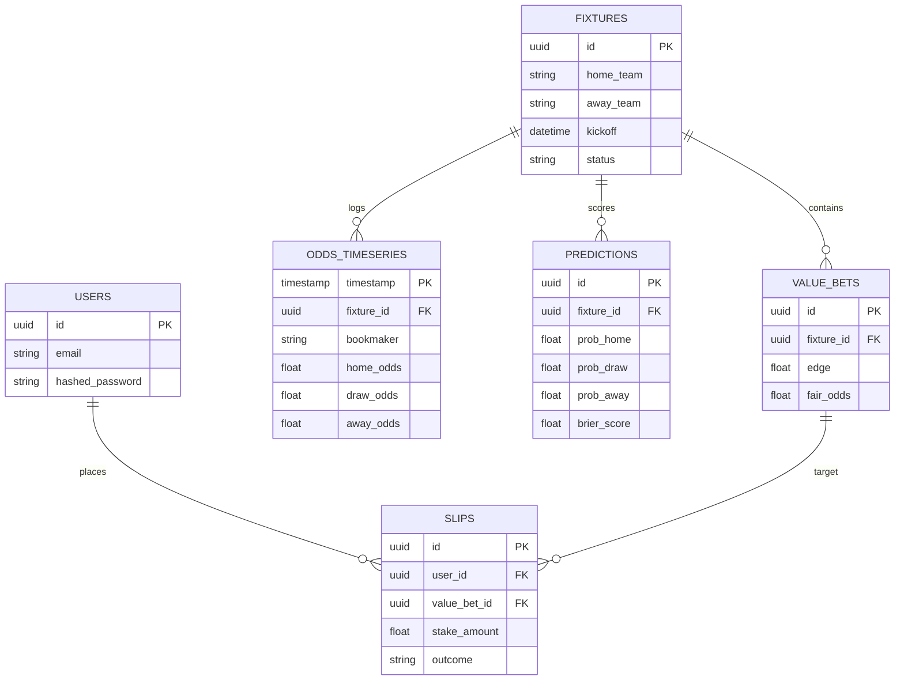

# 🦾 Enterprise Architecture: Database & Storage Architecture Blueprint

## 📋 Governance & Control Metadata
- **Status**: APPROVED (Enterprise Standard)
- **Review Frequency**: Bi-annual
- **Owner**: Principal Software Architect
- **Cross References**: system-overview, backend-architecture, data-ingestion
- **Revision History**:
- `v1.0.0` (2026-06-29): Initial baseline Database blueprint.

---

## 🎯 1. Purpose & Objectives
Exposes database design schemas, TimescaleDB configurations, indexing, partitioning, and backup strategies.

---

## 🔍 2. Scope & Applicability
Mandatory handbook for database administrators, backend developers, and data engineers.

---

## 🏢 3. Structural Responsibilities
- **Responsibility**: Manage relational schema models and ensure clean transactional consistency.
- **Responsibility**: Optimize timeseries storage for high-frequency live bookmaker odds.
- **Responsibility**: Enforce robust continuous backup systems and quick point-in-time recovery (PITR) playbooks.

---

## 🎨 4. Core Design Principles
- **Design Principle**: Normalized Core: Maintain highly normalized relationships for transactional tables (fixtures, users, slips).
- **Design Principle**: Efficient Timeseries: Partition and compress historic high-frequency odds tables to limit disk costs.
- **Design Principle**: Single Point of Modification: All database updates must run via migration files.

---

## 🛠️ 5. Architectural Decisions (ADR Alignment)
- **Architectural Decision**: Deploy PostgreSQL 16 with TimescaleDB extensions enabled.
- **Architectural Decision**: Establish `odds_timeseries` as a hypertable partitioned dynamically into 24-hour chunks.

---

## 📊 6. Architectural Diagrams

### 🗄️ Relational Schema Entity Relationship Diagram (ERD)

---

## 💡 8. Implementation Best Practices
- **Best Practice**: Add compound indexes on tables regularly queried together (e.g., `fixture_id` + `bookmaker_id` in odds tables).
- **Best Practice**: Configure auto-vacuuming and write-ahead-logging (WAL) parameters based on high-write ingestion loads.

---

## ❌ 9. Architectural Anti-patterns
- **Anti-Pattern**: Storing huge raw JSON strings in relational text fields, bypassing Postgres type validation checks.
- **Anti-Pattern**: Running analytics queries directly on production master database nodes instead of read-replicas.

---

## 🔒 10. Security & Threat Considerations
- **Boundary Controls**: Strict ingress-egress filtering and validation on all interaction pathways.
- **Identity & Access**: Zero-trust approach to internal calls and API authentication.
- **Security Posture**: Database password hashes utilize modern encryption standards. Data-at-rest and data-in-transit are encrypted.

---

## ⚡ 11. Performance Considerations
- **Execution Budget**: Low-latency benchmarks targeting p95 boundaries.
- **Caching & Caching Strategy**: Read-aside cache patterns combined with transactional isolation.
- **Performance Details**: Uses PgBouncer for high-efficiency connection pooling, and optimizes indexes to keep query runtimes < 10ms.

---

## 📈 12. Scalability Considerations
- **Horizontal Scaling**: Stateless execution nodes capable of elastic growth.
- **Data Scaling**: TimescaleDB partitioning and query-read-replica isolation.
- **Scalability Details**: Uses TimescaleDB compression policies to reduce historical timeseries footprints by up to 90%, preserving server storage.

---

## 🧪 13. Comprehensive Testing Strategy
- **Unit Boundary Verification**: 100% logic coverage of calculations and data formats.
- **Integration & Validation Paths**: End-to-end sandbox simulations validating pipeline integrity.
- **Testing Approach**: Database migrations are validated against local transient containers before applying on production environments.

---

## 🔧 14. Operational Considerations
- **Logging & Visibility**: Structured JSON logs emitted directly to log aggregation collectors.
- **Alerting thresholds**: SRE metrics integrated with Slack/Telegram escalation schedules.
- **Operational Details**: Tracks DB health metrics including index hit ratios, active lock counts, and backup verification results.

---

## ⚠️ 15. Common Architectural Mistakes
- **Execution Mistake**: Executing schema alterations on large active production tables without pre-evaluating table locks.
- **Execution Mistake**: Failing to monitor DB storage limits, risking complete container freezing.

---

## 🚀 16. Continuous Future Improvements
- **Future Improvement**: Integrate automatic slow query alerting to identify and fix unindexed queries before they cause outages.
- **Future Improvement**: Enable automated database failover across read replica pools.

---

## 🕵️ 17. Architecture Review Checklist
- [ ] **Verify**: Confirm all tables have auto-incrementing bigserial or UUID primary keys.
- [ ] **Verify**: Verify that TimescaleDB compression is scheduled to trigger on data older than 7 days.

---

## 🔗 18. References & Linked Resources
- [system-overview](system-overview.md)
- [backend-architecture](backend-architecture.md)
- [data-ingestion](data-ingestion.md)
