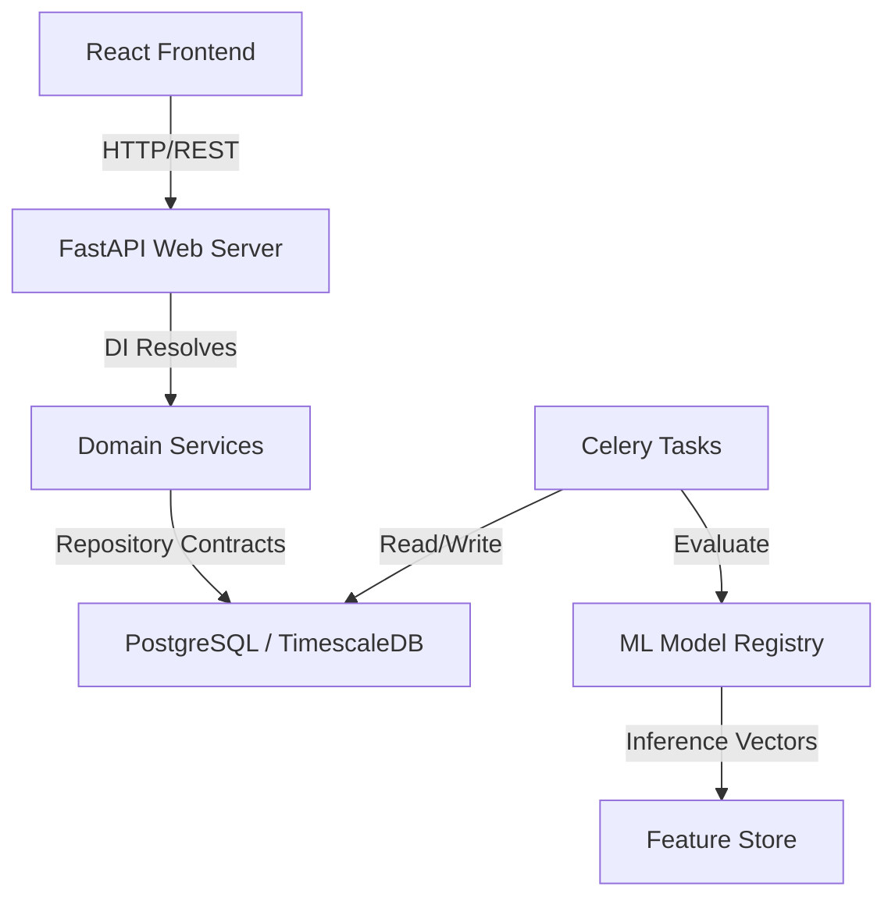

# 🦾 Enterprise Architecture: Dependency Graph & Circular Dependency Prevention

## 📋 Governance & Control Metadata
- **Status**: APPROVED (Enterprise Standard)
- **Review Frequency**: Bi-annual
- **Owner**: Principal Software Architect
- **Cross References**: bounded-contexts, clean-architecture, architecture-index
- **Revision History**:
- `v1.0.0` (2026-06-29): Initial baseline dependency map.

---

## 🎯 1. Purpose & Objectives
Exposes system dependency directions, module rules, and structures preventing circular reference loops.

---

## 🔍 2. Scope & Applicability
Repository-wide architecture verification gate.

---

## 🏢 3. Structural Responsibilities
- **Responsibility**: Document all internal and external module dependencies.
- **Responsibility**: Provide concrete strategies to break circular import dependencies.
- **Responsibility**: Define clear workspace directories ownership boundaries.

---

## 🎨 4. Core Design Principles
- **Design Principle**: Unidirectional Flow: Dependencies must only flow down from higher layers (UI) to lower layers (DB).
- **Design Principle**: Dependency Inversion: Higher-level modules depend on abstractions (interfaces), not concrete implementations.

---

## 🛠️ 5. Architectural Decisions (ADR Alignment)
- **Architectural Decision**: Integrate strict dependency check tools (like import-linter or dependency-cruiser) inside PR validation workflows.
- **Architectural Decision**: Decouple modules by introducing domain events instead of direct model imports.

---

## 📊 6. Architectural Diagrams

---

## 💡 8. Implementation Best Practices
- **Best Practice**: Never import files from another bounded context directly; interact exclusively via context interfaces or events.
- **Best Practice**: Extract shared model classes, utilities, and constants to a common shared library package.

---

## ❌ 9. Architectural Anti-patterns
- **Anti-Pattern**: Module A importing Module B, which imports Module A, causing runtime import failures.
- **Anti-Pattern**: Allowing presentation helpers to import backend database schemas.

---

## 🔒 10. Security & Threat Considerations
- **Boundary Controls**: Strict ingress-egress filtering and validation on all interaction pathways.
- **Identity & Access**: Zero-trust approach to internal calls and API authentication.
- **Security Posture**: A clean, well-defined dependency graph prevents malicious code injection from spreading across isolated modules.

---

## ⚡ 11. Performance Considerations
- **Execution Budget**: Low-latency benchmarks targeting p95 boundaries.
- **Caching & Caching Strategy**: Read-aside cache patterns combined with transactional isolation.
- **Performance Details**: Reduces application bundle sizes (frontend) and node memory footprints (backend) by eliminating bloated imports.

---

## 📈 12. Scalability Considerations
- **Horizontal Scaling**: Stateless execution nodes capable of elastic growth.
- **Data Scaling**: TimescaleDB partitioning and query-read-replica isolation.
- **Scalability Details**: Easily isolate and migrate decoupled sub-modules into microservices as requirements scale.

---

## 🧪 13. Comprehensive Testing Strategy
- **Unit Boundary Verification**: 100% logic coverage of calculations and data formats.
- **Integration & Validation Paths**: End-to-end sandbox simulations validating pipeline integrity.
- **Testing Approach**: Allows isolated mocking of dependent modules, accelerating testing runtimes.

---

## 🔧 14. Operational Considerations
- **Logging & Visibility**: Structured JSON logs emitted directly to log aggregation collectors.
- **Alerting thresholds**: SRE metrics integrated with Slack/Telegram escalation schedules.
- **Operational Details**: Simplifies error tracebacks, indicating exactly where a failure originated.

---

## ⚠️ 15. Common Architectural Mistakes
- **Execution Mistake**: Importing domain entities directly inside database migration files.
- **Execution Mistake**: Creating cross-context circular relations in SQLAlchemy tables.

---

## 🚀 16. Continuous Future Improvements
- **Future Improvement**: Automate dependency graph generation inside every production build documentation runner.
- **Future Improvement**: Transition codebase to a monorepo setup to strictly isolate packages.

---

## 🕵️ 17. Architecture Review Checklist
- [ ] **Verify**: Verify that zero circular dependencies are highlighted by linter checks.
- [ ] **Verify**: Confirm that the Shared Kernel has zero dependencies on other platform modules.

---

## 🔗 18. References & Linked Resources
- [bounded-contexts](bounded-contexts.md)
- [clean-architecture](clean-architecture.md)
- [architecture-index](architecture-index.md)
