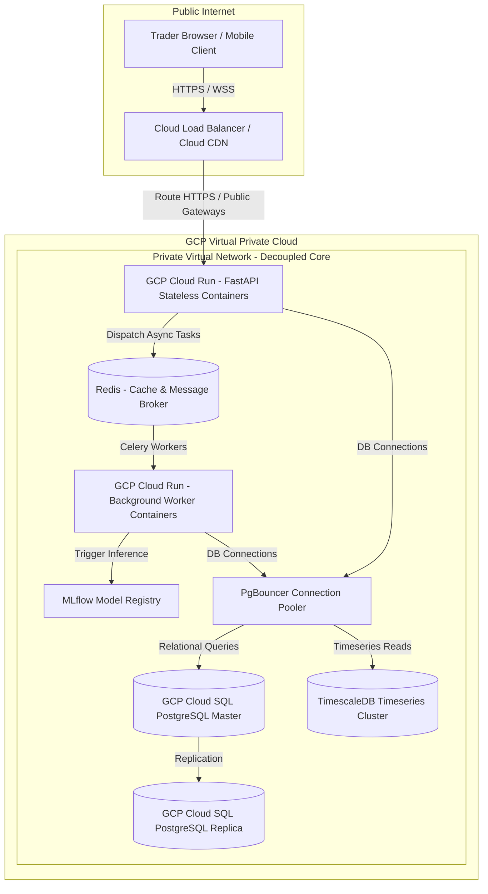

# 🦾 Enterprise Architecture: Platform Deployment Diagrams

## 📋 Governance & Control Metadata
- **Status**: APPROVED (Enterprise Standard)
- **Review Frequency**: Bi-annual
- **Owner**: Principal Software Architect
- **Cross References**: infrastructure, deployment, disaster-recovery
- **Revision History**:
- `v1.0.0` (2026-06-29): Initial baseline Deployment Diagrams released.

---

## 🎯 1. Purpose & Objectives
Exposes production deployment layouts, cloud environments, container networks, and routing paths.

---

## 🔍 2. Scope & Applicability
Universal infrastructure blueprint for DevOps and SRE teams.

---

## 🏢 3. Structural Responsibilities
- **Responsibility**: Detail physical production cloud configurations and networking paths.
- **Responsibility**: Specify container grouping, load balancing, firewall structures, and DB clusters.
- **Responsibility**: Serve as the master operational handbook for SREs configuring production networks.

---

## 🎨 4. Core Design Principles
- **Design Principle**: Defense in Depth: Protect systems using multiple layers of firewalls, private subnets, and IAM roles.
- **Design Principle**: High Availability: Deploy container nodes across multiple zones to ensure continuous service runtimes.

---

## 🛠️ 5. Architectural Decisions (ADR Alignment)
- **Architectural Decision**: Use Google Cloud Platform (GCP) as the primary production cloud platform.
- **Architectural Decision**: Deploy application containers within Google Cloud Run, utilizing GCP load balancers and Cloud SQL.

---

## 📊 6. Architectural Diagrams

### 🌐 GCP Production Deployment Infrastructure (C4 Deployment Diagram)

---

## 💡 8. Implementation Best Practices
- **Best Practice**: Isolate backend database, cache, and worker nodes inside private virtual networks.
- **Best Practice**: Manage all infrastructure configurations using Terraform scripts.

---

## ❌ 9. Architectural Anti-patterns
- **Anti-Pattern**: Exposing database or Redis connection ports directly to the public internet.
- **Anti-Pattern**: Hardcoding cloud secrets inside static infrastructure definitions.

---

## 🔒 10. Security & Threat Considerations
- **Boundary Controls**: Strict ingress-egress filtering and validation on all interaction pathways.
- **Identity & Access**: Zero-trust approach to internal calls and API authentication.
- **Security Posture**: All public endpoints require TLS v1.3. Private networks are locked behind Cloud IAM roles.

---

## ⚡ 11. Performance Considerations
- **Execution Budget**: Low-latency benchmarks targeting p95 boundaries.
- **Caching & Caching Strategy**: Read-aside cache patterns combined with transactional isolation.
- **Performance Details**: GCP load balancers terminate SSL quickly and route traffic via fast, low-latency fibers.

---

## 📈 12. Scalability Considerations
- **Horizontal Scaling**: Stateless execution nodes capable of elastic growth.
- **Data Scaling**: TimescaleDB partitioning and query-read-replica isolation.
- **Scalability Details**: Cloud Run dynamically auto-scales container counts from 0 to 100+ to handle sudden traffic peaks.

---

## 🧪 13. Comprehensive Testing Strategy
- **Unit Boundary Verification**: 100% logic coverage of calculations and data formats.
- **Integration & Validation Paths**: End-to-end sandbox simulations validating pipeline integrity.
- **Testing Approach**: Verified in staging sandbox environments prior to production terraform deployments.

---

## 🔧 14. Operational Considerations
- **Logging & Visibility**: Structured JSON logs emitted directly to log aggregation collectors.
- **Alerting thresholds**: SRE metrics integrated with Slack/Telegram escalation schedules.
- **Operational Details**: Operational alerts track database storage limits, load balancer errors, and auto-scaling status.

---

## ⚠️ 15. Common Architectural Mistakes
- **Execution Mistake**: Placing background workers in the same auto-scaling container pool as the API gateway, risking slow response times.
- **Execution Mistake**: Omitting database read replicas, flooding master databases during traffic surges.

---

## 🚀 16. Continuous Future Improvements
- **Future Improvement**: Deploy multi-region failover load balancers.
- **Future Improvement**: Incorporate serverless PostgreSQL configurations to scale storage dynamically.

---

## 🕵️ 17. Architecture Review Checklist
- [ ] **Verify**: Verify that all database and Redis connection points require secure private networks.
- [ ] **Verify**: Confirm that the Terraform configuration matches the active production cloud setup.

---

## 🔗 18. References & Linked Resources
- [infrastructure](infrastructure.md)
- [deployment](deployment.md)
- [disaster-recovery](disaster-recovery.md)
