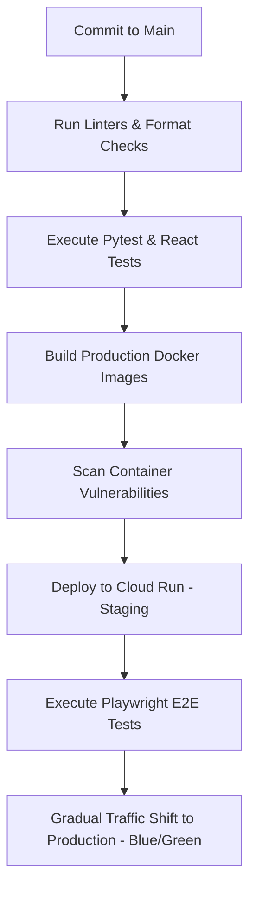

# 🦾 Enterprise Architecture: Deployment & CI/CD Pipeline

## 📋 Governance & Control Metadata
- **Status**: APPROVED (Enterprise Standard)
- **Review Frequency**: Bi-annual
- **Owner**: Principal Software Architect
- **Cross References**: infrastructure, disaster-recovery, testing
- **Revision History**:
- `v1.0.0` (2026-06-29): Initial baseline Deployment spec.

---

## 🎯 1. Purpose & Objectives
Exposes the automated deployment, integration pipeline, and zero-downtime release blueprints.

---

## 🔍 2. Scope & Applicability
Universal standard for continuous deployment and release configurations.

---

## 🏢 3. Structural Responsibilities
- **Responsibility**: Coordinate CI/CD pipelines verifying commits before merging to primary branches.
- **Responsibility**: Automate linting, unit testing, and vulnerability check steps.
- **Responsibility**: Deploy zero-downtime blue-green upgrades on Cloud Run clusters.

---

## 🎨 4. Core Design Principles
- **Design Principle**: Continuous Integration: Commits to the primary branch must be verified automatically.
- **Design Principle**: Zero-Downtime Deployments: Maintain active server runtimes during releases using gradual routing shifts.

---

## 🛠️ 5. Architectural Decisions (ADR Alignment)
- **Architectural Decision**: Use GitHub Actions to orchestrate pipeline steps.
- **Architectural Decision**: Deploy to Google Cloud Run utilizing blue-green gradual traffic allocations.

---

## 📊 6. Architectural Diagrams

---

## 💡 8. Implementation Best Practices
- **Best Practice**: Require senior engineer approvals before merging changes to production release channels.
- **Best Practice**: Automate rollback procedures if any deployment shows performance anomalies.

---

## ❌ 9. Architectural Anti-patterns
- **Anti-Pattern**: Deploying changes directly to production servers manually.
- **Anti-Pattern**: Skipping linting or testing steps to bypass pipeline runtimes.

---

## 🔒 10. Security & Threat Considerations
- **Boundary Controls**: Strict ingress-egress filtering and validation on all interaction pathways.
- **Identity & Access**: Zero-trust approach to internal calls and API authentication.
- **Security Posture**: CI/CD pipelines authenticate with Google Cloud using secure OIDC credentials, eliminating static key risks.

---

## ⚡ 11. Performance Considerations
- **Execution Budget**: Low-latency benchmarks targeting p95 boundaries.
- **Caching & Caching Strategy**: Read-aside cache patterns combined with transactional isolation.
- **Performance Details**: Deployments compile quickly, resolving complete build-to-test checks in under 5 minutes.

---

## 📈 12. Scalability Considerations
- **Horizontal Scaling**: Stateless execution nodes capable of elastic growth.
- **Data Scaling**: TimescaleDB partitioning and query-read-replica isolation.
- **Scalability Details**: Facilitates elastic deployment across global environments.

---

## 🧪 13. Comprehensive Testing Strategy
- **Unit Boundary Verification**: 100% logic coverage of calculations and data formats.
- **Integration & Validation Paths**: End-to-end sandbox simulations validating pipeline integrity.
- **Testing Approach**: Pipelines require 100% test success before enabling container promotions.

---

## 🔧 14. Operational Considerations
- **Logging & Visibility**: Structured JSON logs emitted directly to log aggregation collectors.
- **Alerting thresholds**: SRE metrics integrated with Slack/Telegram escalation schedules.
- **Operational Details**: Deployment logs trace pipeline durations, build successes, and container tags.

---

## ⚠️ 15. Common Architectural Mistakes
- **Execution Mistake**: Merging untested database migrations that lock production tables.
- **Execution Mistake**: Failing to run integration tests prior to traffic routing shifts.

---

## 🚀 16. Continuous Future Improvements
- **Future Improvement**: Incorporate AI-powered deployment anomaly detectors.
- **Future Improvement**: Deploy automated Canary testing patterns.

---

## 🕵️ 17. Architecture Review Checklist
- [ ] **Verify**: Confirm that all pipeline actions use exact version hashes.
- [ ] **Verify**: Verify that rollback playbooks can execute with a single click.

---

## 🔗 18. References & Linked Resources
- [infrastructure](infrastructure.md)
- [disaster-recovery](disaster-recovery.md)
- [testing](testing.md)
