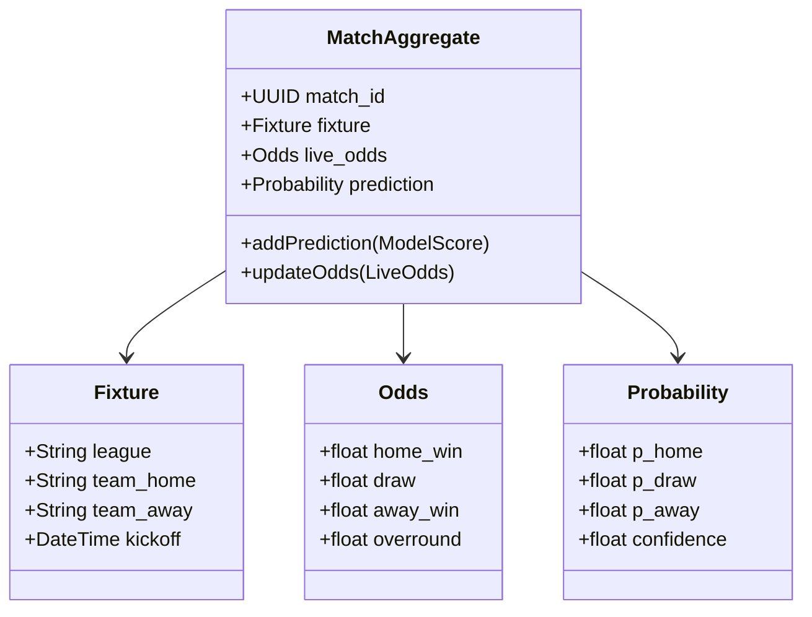

# 🦾 Enterprise Architecture: Domain-Driven Design (DDD) Reference

## 📋 Governance & Control Metadata
- **Status**: APPROVED (Enterprise Standard)
- **Review Frequency**: Bi-annual
- **Owner**: Principal Software Architect
- **Cross References**: clean-architecture, bounded-contexts, module-interactions
- **Revision History**:
- `v1.0.0` (2026-06-29): Initial baseline DDD specification.

---

## 🎯 1. Purpose & Objectives
Exposes core tactical and strategic DDD patterns used to structure the platform code.

---

## 🔍 2. Scope & Applicability
Mandatory standard for organizing modules, bounded contexts, and state invariants.

---

## 🏢 3. Structural Responsibilities
- **Responsibility**: Define domains, subdomains, aggregates, value objects, and domain events.
- **Responsibility**: Delineate bounded contexts to prevent model confusion (e.g. odds in scraper vs odds in sizer).
- **Responsibility**: Manage global transactional integrity through strict Aggregate Root boundaries.

---

## 🎨 4. Core Design Principles
- **Design Principle**: Ubiquitous Language: Use shared terminology (e.g. Overround, Fair Odds, Kelly Slip, Margin) across code, databases, and business documents.
- **Design Principle**: Transactional Consistency: Ensure invariants within an Aggregate Root are updated in a single transaction.

---

## 🛠️ 5. Architectural Decisions (ADR Alignment)
- **Architectural Decision**: Organize directories by bounded contexts rather than technical layers (e.g., backend/prediction/ rather than backend/services/).
- **Architectural Decision**: Publish Domain Events asynchronously to communicate changes between isolated bounded contexts.

---

## 📊 6. Architectural Diagrams

---

## 💡 8. Implementation Best Practices
- **Best Practice**: Keep value objects immutable; return new instances on modifications.
- **Best Practice**: Only Reference Aggregates by ID; never embed raw child objects across context boundaries.

---

## ❌ 9. Architectural Anti-patterns
- **Anti-Pattern**: Anemic Domain Model: Aggregates containing only getters/setters with logic residing in services.
- **Anti-Pattern**: Allowing direct cross-context database joins in SQLAlchemy or raw queries.

---

## 🔒 10. Security & Threat Considerations
- **Boundary Controls**: Strict ingress-egress filtering and validation on all interaction pathways.
- **Identity & Access**: Zero-trust approach to internal calls and API authentication.
- **Security Posture**: Aggregate boundaries prevent corrupt state updates, safeguarding financial slips from illegitimate adjustments.

---

## ⚡ 11. Performance Considerations
- **Execution Budget**: Low-latency benchmarks targeting p95 boundaries.
- **Caching & Caching Strategy**: Read-aside cache patterns combined with transactional isolation.
- **Performance Details**: Aggregates limit database locking scope, keeping transactions fast and concurrent.

---

## 📈 12. Scalability Considerations
- **Horizontal Scaling**: Stateless execution nodes capable of elastic growth.
- **Data Scaling**: TimescaleDB partitioning and query-read-replica isolation.
- **Scalability Details**: Since bounded contexts are decoupled, they can be easily split into standalone microservices as platform scale increases.

---

## 🧪 13. Comprehensive Testing Strategy
- **Unit Boundary Verification**: 100% logic coverage of calculations and data formats.
- **Integration & Validation Paths**: End-to-end sandbox simulations validating pipeline integrity.
- **Testing Approach**: Value objects and aggregates are tested deterministically through stateless unit assertions.

---

## 🔧 14. Operational Considerations
- **Logging & Visibility**: Structured JSON logs emitted directly to log aggregation collectors.
- **Alerting thresholds**: SRE metrics integrated with Slack/Telegram escalation schedules.
- **Operational Details**: Domain events serve as natural audit logs and analytical stream inputs.

---

## ⚠️ 15. Common Architectural Mistakes
- **Execution Mistake**: Making the entire database a single gigantic aggregate, causing frequent lock contentions.
- **Execution Mistake**: Leaking domain invariants into database schema configurations.

---

## 🚀 16. Continuous Future Improvements
- **Future Improvement**: Introduce events auditing engines to persist and trace published domain events historically.
- **Future Improvement**: Leverage event-sourcing for critical ledger-related contexts like Bankroll Slip changes.

---

## 🕵️ 17. Architecture Review Checklist
- [ ] **Verify**: Confirm all domain events have unique UUID trackers and timestamps.
- [ ] **Verify**: Verify that value objects override equality checks based on their internal properties.

---

## 🔗 18. References & Linked Resources
- [clean-architecture](clean-architecture.md)
- [bounded-contexts](bounded-contexts.md)
- [module-interactions](module-interactions.md)
