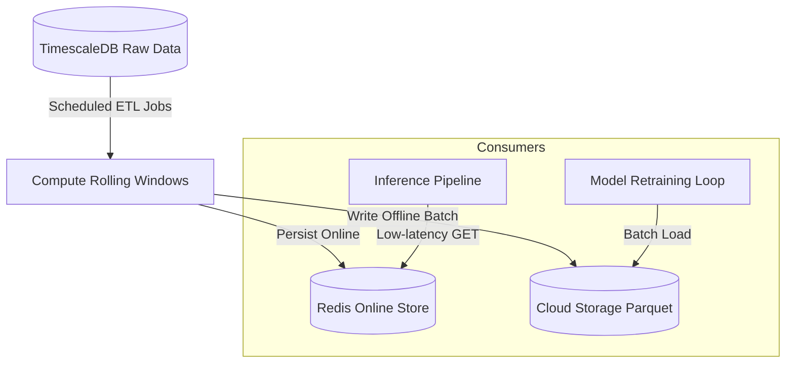

# 🦾 Enterprise Architecture: Feature Store Specification

## 📋 Governance & Control Metadata
- **Status**: APPROVED (Enterprise Standard)
- **Review Frequency**: Bi-annual
- **Owner**: Principal Software Architect
- **Cross References**: database-architecture, feature-engineering, ml-pipeline
- **Revision History**:
- `v1.0.0` (2026-06-29): Initial baseline Feature Store blueprint.

---

## 🎯 1. Purpose & Objectives
Exposes how the platform computes, stores, and serves features for model training and real-time inference.

---

## 🔍 2. Scope & Applicability
Mandatory guide for machine learning engineers and data scientists.

---

## 🏢 3. Structural Responsibilities
- **Responsibility**: Store standardized sports-analytics feature vectors historically and serve them with low latency.
- **Responsibility**: Enforce exact point-in-time correctness to prevent data leakage during model training runs.
- **Responsibility**: Maintain feature schemas, descriptions, and operational metadata.

---

## 🎨 4. Core Design Principles
- **Design Principle**: Dual Serving: Feature store must serve high-throughput offline batches (training) and low-latency online values (inference).
- **Design Principle**: Consistent Definitions: Use identical SQL/Python definitions for features across offline and online environments.

---

## 🛠️ 5. Architectural Decisions (ADR Alignment)
- **Architectural Decision**: Utilize a specialized Feature Store schema on PostgreSQL for online serving.
- **Architectural Decision**: Save historical features inside highly compressed Parquet format files on Cloud Storage for cheap training access.

---

## 📊 6. Architectural Diagrams

---

## 💡 8. Implementation Best Practices
- **Best Practice**: Track and audit all feature versions alongside model performance metrics.
- **Best Practice**: Regularly calculate statistical feature drift (e.g., tracking mean feature drift vs baseline profiles).

---

## ❌ 9. Architectural Anti-patterns
- **Anti-Pattern**: Calculating heavy rolling features on-the-fly inside real-time prediction loops.
- **Anti-Pattern**: Overwriting historical features with modern values, creating complete data leakage.

---

## 🔒 10. Security & Threat Considerations
- **Boundary Controls**: Strict ingress-egress filtering and validation on all interaction pathways.
- **Identity & Access**: Zero-trust approach to internal calls and API authentication.
- **Security Posture**: Access to the Feature Store is restricted via fine-grained IAM roles to authenticated ML worker nodes.

---

## ⚡ 11. Performance Considerations
- **Execution Budget**: Low-latency benchmarks targeting p95 boundaries.
- **Caching & Caching Strategy**: Read-aside cache patterns combined with transactional isolation.
- **Performance Details**: Real-time feature queries utilize Redis-backed caches, keeping feature retrieval times below 5ms.

---

## 📈 12. Scalability Considerations
- **Horizontal Scaling**: Stateless execution nodes capable of elastic growth.
- **Data Scaling**: TimescaleDB partitioning and query-read-replica isolation.
- **Scalability Details**: Feature tables are scaled using partition patterns matching league, season, or match kickoff times.

---

## 🧪 13. Comprehensive Testing Strategy
- **Unit Boundary Verification**: 100% logic coverage of calculations and data formats.
- **Integration & Validation Paths**: End-to-end sandbox simulations validating pipeline integrity.
- **Testing Approach**: Tested using statistical validation checks (e.g. Great Expectations) asserting feature range and completeness.

---

## 🔧 14. Operational Considerations
- **Logging & Visibility**: Structured JSON logs emitted directly to log aggregation collectors.
- **Alerting thresholds**: SRE metrics integrated with Slack/Telegram escalation schedules.
- **Operational Details**: Monitors feature store health, tracking features null-value rates, data volumes, and update schedules.

---

## ⚠️ 15. Common Architectural Mistakes
- **Execution Mistake**: Mixing training target labels inside real-time inference feature sets.
- **Execution Mistake**: Failing to handle missing feature inputs, causing model scoring crashes.

---

## 🚀 16. Continuous Future Improvements
- **Future Improvement**: Migrate feature serving to specialized enterprise feature store platforms (like Feast).
- **Future Improvement**: Automate dynamic feature selection pipelines based on information gain analysis.

---

## 🕵️ 17. Architecture Review Checklist
- [ ] **Verify**: Confirm that the Feature Store has zero direct dependencies on raw staging tables.
- [ ] **Verify**: Verify that all rolling features utilize safe point-in-time queries to avoid future-leakage.

---

## 🔗 18. References & Linked Resources
- [database-architecture](database-architecture.md)
- [feature-engineering](feature-engineering.md)
- [ml-pipeline](ml-pipeline.md)
