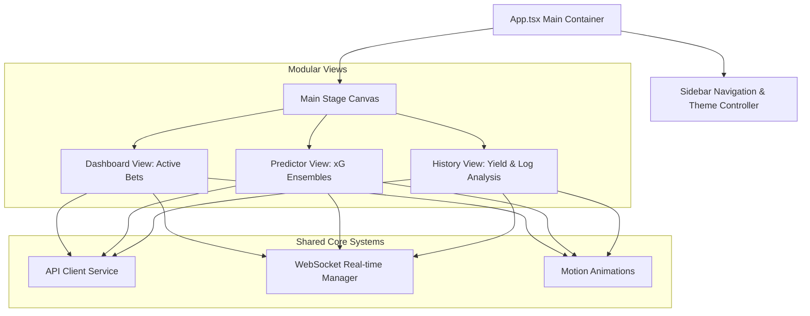

# 🦾 Enterprise Architecture: Frontend Architecture Blueprint

## 📋 Governance & Control Metadata
- **Status**: APPROVED (Enterprise Standard)
- **Review Frequency**: Bi-annual
- **Owner**: Principal Software Architect
- **Cross References**: system-overview, api-architecture, testing
- **Revision History**:
- `v1.0.0` (2026-06-29): Initial baseline Frontend blueprint.

---

## 🎯 1. Purpose & Objectives
Exposes React 19 / Vite / Tailwind UI component hierarchy, state management, and asset structure.

---

## 🔍 2. Scope & Applicability
Mandatory standard for all frontend engineering additions.

---

## 🏢 3. Structural Responsibilities
- **Responsibility**: Define component folder structure, layouts, and custom state managers.
- **Responsibility**: Specify secure API calling mechanisms, WebSocket handlers, and route protection rules.
- **Responsibility**: Enforce accessibility (WAI-ARIA) and performance rendering guidelines.

---

## 🎨 4. Core Design Principles
- **Design Principle**: Declarative Rendering: UI state is an immutable function of data, animated gracefully via Motion.
- **Design Principle**: Visual Consistency: Style elements exclusively using Tailwind utility tokens, adhering strictly to the Cosmic theme.
- **Design Principle**: Component Isolation: Keep UI components lean and stateless, delegating heavy logic to custom React hooks.

---

## 🛠️ 5. Architectural Decisions (ADR Alignment)
- **Architectural Decision**: Use Vite as the build tool for extremely fast development builds and bundle optimization.
- **Architectural Decision**: Leverage Recharts for clean, responsive data visualizations and historical ROI charting.

---

## 📊 6. Architectural Diagrams

---

## 💡 8. Implementation Best Practices
- **Best Practice**: Wrap all lazy-loaded route tabs inside Suspense blocks containing clean skeleton loaders.
- **Best Practice**: Manage API states cleanly to prevent duplicate rendering and data flickering.

---

## ❌ 9. Architectural Anti-patterns
- **Anti-Pattern**: Consolidating all UI states, charts, and table handlers inside App.tsx.
- **Anti-Pattern**: Manipulating DOM elements directly instead of using React state controls.

---

## 🔒 10. Security & Threat Considerations
- **Boundary Controls**: Strict ingress-egress filtering and validation on all interaction pathways.
- **Identity & Access**: Zero-trust approach to internal calls and API authentication.
- **Security Posture**: XSS protection enabled via React JSX auto-escaping. Authentication tokens are handled inside safe HttpOnly cookies.

---

## ⚡ 11. Performance Considerations
- **Execution Budget**: Low-latency benchmarks targeting p95 boundaries.
- **Caching & Caching Strategy**: Read-aside cache patterns combined with transactional isolation.
- **Performance Details**: Optimized using React memo, lazy-loading routes, and code splitting, yielding Google Lighthouse scores > 90.

---

## 📈 12. Scalability Considerations
- **Horizontal Scaling**: Stateless execution nodes capable of elastic growth.
- **Data Scaling**: TimescaleDB partitioning and query-read-replica isolation.
- **Scalability Details**: Clean component decomposition allows multiple developers to work concurrently on separate panels.

---

## 🧪 13. Comprehensive Testing Strategy
- **Unit Boundary Verification**: 100% logic coverage of calculations and data formats.
- **Integration & Validation Paths**: End-to-end sandbox simulations validating pipeline integrity.
- **Testing Approach**: Validated via React Testing Library unit assertions and comprehensive Playwright end-to-end user path simulations.

---

## 🔧 14. Operational Considerations
- **Logging & Visibility**: Structured JSON logs emitted directly to log aggregation collectors.
- **Alerting thresholds**: SRE metrics integrated with Slack/Telegram escalation schedules.
- **Operational Details**: Emits structured telemetry events to detect dashboard performance anomalies and uncaught exceptions.

---

## ⚠️ 15. Common Architectural Mistakes
- **Execution Mistake**: Failing to clean up active WebSockets or intervals on component unmounting, leading to memory leaks.
- **Execution Mistake**: Using non-responsive, fixed pixel widths on layout boxes, breaking mobile viewport rendering.

---

## 🚀 16. Continuous Future Improvements
- **Future Improvement**: Transition state management to Zustland or Redux Toolkit if application logic complexifies.
- **Future Improvement**: Configure Tailwind CSS purging rules to minimize production CSS bundle footprints.

---

## 🕵️ 17. Architecture Review Checklist
- [ ] **Verify**: Confirm all image tags declare referrerPolicy="no-referrer" for privacy and safety.
- [ ] **Verify**: Verify that all interactive elements have explicit, readable IDs for testing and accessibility.

---

## 🔗 18. References & Linked Resources
- [system-overview](system-overview.md)
- [api-architecture](api-architecture.md)
- [testing](testing.md)
