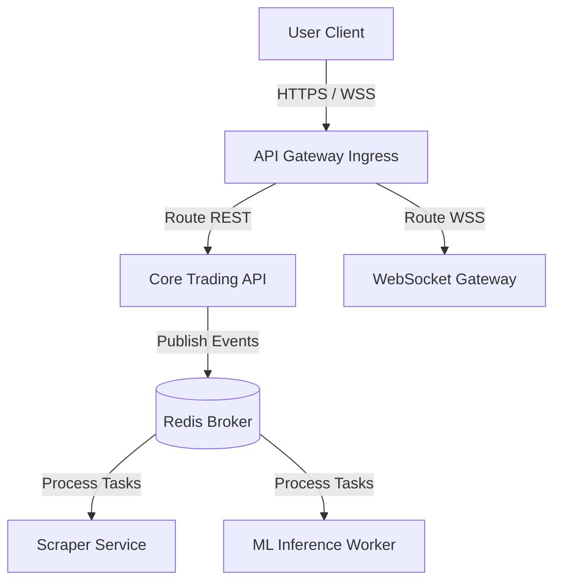

# 🦾 Enterprise Architecture: Microservice Topology & Gateway Boundaries

## 📋 Governance & Control Metadata
- **Status**: APPROVED (Enterprise Standard)
- **Review Frequency**: Bi-annual
- **Owner**: Principal Software Architect
- **Cross References**: bounded-contexts, module-interactions, api-architecture
- **Revision History**:
- `v1.0.0` (2026-06-29): Initial baseline Microservices specification.

---

## 🎯 1. Purpose & Objectives
Exposes service boundaries, gateway configurations, and deployment topologies for modular services.

---

## 🔍 2. Scope & Applicability
Universal guide for microservice designers and infrastructure engineers.

---

## 🏢 3. Structural Responsibilities
- **Responsibility**: Define boundaries separating core API services from background workers and data scrapers.
- **Responsibility**: Configure API Gateway routing rules, handling traffic shifts and authorization checks.
- **Responsibility**: Enforce decoupled messaging patterns to allow independent service lifecycles.

---

## 🎨 4. Core Design Principles
- **Design Principle**: Domain Decoupling: Services must own their databases; never share schemas across distinct service boundaries.
- **Design Principle**: Asynchronous Communication: Standardize on async event pub-sub to maintain system resilience.

---

## 🛠️ 5. Architectural Decisions (ADR Alignment)
- **Architectural Decision**: Adopt a modular monolith design with clear bounded contexts, easing transition to full microservices when needed.
- **Architectural Decision**: Route all external user requests through a unified API gateway terminal.

---

## 📊 6. Architectural Diagrams

---

## 💡 8. Implementation Best Practices
- **Best Practice**: Implement circuit breakers to prevent failing services from causing system-wide cascades.
- **Best Practice**: Incorporate consistent correlation IDs to enable tracing across microservice boundaries.

---

## ❌ 9. Architectural Anti-patterns
- **Anti-Pattern**: Creating highly chatty synchronous API chains across microservices.
- **Anti-Pattern**: Sharing relational tables directly across decoupled backend systems.

---

## 🔒 10. Security & Threat Considerations
- **Boundary Controls**: Strict ingress-egress filtering and validation on all interaction pathways.
- **Identity & Access**: Zero-trust approach to internal calls and API authentication.
- **Security Posture**: Intra-service communication is encrypted and restricted using private virtual networks.

---

## ⚡ 11. Performance Considerations
- **Execution Budget**: Low-latency benchmarks targeting p95 boundaries.
- **Caching & Caching Strategy**: Read-aside cache patterns combined with transactional isolation.
- **Performance Details**: Reduces connection overheads using HTTP/2 or gRPC for internal service communications.

---

## 📈 12. Scalability Considerations
- **Horizontal Scaling**: Stateless execution nodes capable of elastic growth.
- **Data Scaling**: TimescaleDB partitioning and query-read-replica isolation.
- **Scalability Details**: Allows services to scale independently based on their specific workload requirements.

---

## 🧪 13. Comprehensive Testing Strategy
- **Unit Boundary Verification**: 100% logic coverage of calculations and data formats.
- **Integration & Validation Paths**: End-to-end sandbox simulations validating pipeline integrity.
- **Testing Approach**: Tested using isolated mock endpoints to verify service interactions.

---

## 🔧 14. Operational Considerations
- **Logging & Visibility**: Structured JSON logs emitted directly to log aggregation collectors.
- **Alerting thresholds**: SRE metrics integrated with Slack/Telegram escalation schedules.
- **Operational Details**: Operational dashboards track inter-service latency, call rates, and circuit status.

---

## ⚠️ 15. Common Architectural Mistakes
- **Execution Mistake**: Failing to handle network timeout exceptions during inter-service API calls.
- **Execution Mistake**: Creating circular dependency networks where Service A calls Service B, which calls Service A.

---

## 🚀 16. Continuous Future Improvements
- **Future Improvement**: Transition key services to highly efficient gRPC architectures.
- **Future Improvement**: Deploy service mesh managers (like Istio) to automate traffic routing.

---

## 🕵️ 17. Architecture Review Checklist
- [ ] **Verify**: Verify that all microservice boundaries align directly with domain bounded contexts.
- [ ] **Verify**: Confirm that failing services do not halt unrelated platform features.

---

## 🔗 18. References & Linked Resources
- [bounded-contexts](bounded-contexts.md)
- [module-interactions](module-interactions.md)
- [api-architecture](api-architecture.md)
