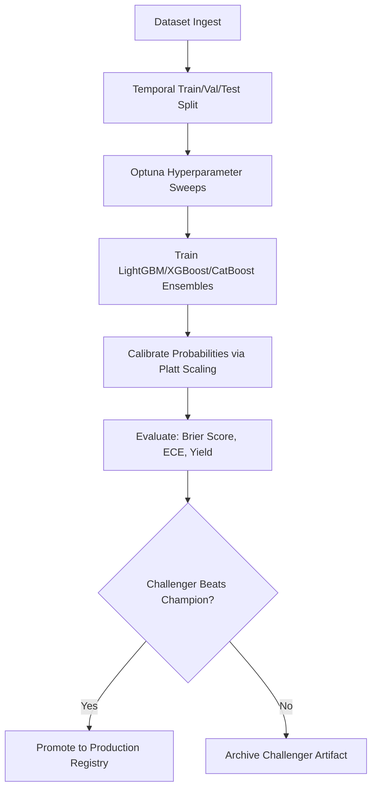

# 🦾 Enterprise Architecture: Machine Learning Ingestion & Retraining Pipeline

## 📋 Governance & Control Metadata
- **Status**: APPROVED (Enterprise Standard)
- **Review Frequency**: Bi-annual
- **Owner**: Principal Software Architect
- **Cross References**: feature-store, feature-engineering, prediction-engine
- **Revision History**:
- `v1.0.0` (2026-06-29): Initial baseline ML Pipeline spec.

---

## 🎯 1. Purpose & Objectives
Exposes how models are trained, evaluated, calibrated, tracked, and safely registered.

---

## 🔍 2. Scope & Applicability
Comprehensive guide for MLOps Engineers and Data Scientists.

---

## 🏢 3. Structural Responsibilities
- **Responsibility**: Coordinate model training, cross-validation, and hyperparameter optimization loops.
- **Responsibility**: Enforce Platt Scaling and Isotonic Regression to output perfectly calibrated probability models.
- **Responsibility**: Implement Champion-Challenger evaluation gates before registering new model versions.

---

## 🎨 4. Core Design Principles
- **Design Principle**: Continuous Validation: Models must always be validated against independent, out-of-time test sets.
- **Design Principle**: Rigor over Hype: Prefer highly interpretable gradient boosted decision trees (LightGBM) over black-box networks.
- **Design Principle**: Traceable Lineage: Every model artifact must link directly to the exact dataset, features, and hyperparameters used to train it.

---

## 🛠️ 5. Architectural Decisions (ADR Alignment)
- **Architectural Decision**: Use Optuna as the unified platform for hyperparameter tuning sweeps.
- **Architectural Decision**: Save trained models in standardized binary serialization formats inside MLflow Model Registry.

---

## 📊 6. Architectural Diagrams

---

## 💡 8. Implementation Best Practices
- **Best Practice**: Enforce a strict temporal validation split: train on seasons 2021-2024, validate on 2025, test on 2026.
- **Best Practice**: Calculate Expected Calibration Error (ECE) and Brier Scores to audit model calibration quality.

---

## ❌ 9. Architectural Anti-patterns
- **Anti-Pattern**: Using traditional randomized K-Fold cross validation on sports timeseries data, causing heavy future-leakage.
- **Anti-Pattern**: Deploying uncalibrated model outputs directly into capital sizing engines.

---

## 🔒 10. Security & Threat Considerations
- **Boundary Controls**: Strict ingress-egress filtering and validation on all interaction pathways.
- **Identity & Access**: Zero-trust approach to internal calls and API authentication.
- **Security Posture**: Model artifact hashes are verified on ingestion to protect system files from arbitrary code injection.

---

## ⚡ 11. Performance Considerations
- **Execution Budget**: Low-latency benchmarks targeting p95 boundaries.
- **Caching & Caching Strategy**: Read-aside cache patterns combined with transactional isolation.
- **Performance Details**: Model scoring is highly parallelized, evaluating batch arrays in less than 3ms per row.

---

## 📈 12. Scalability Considerations
- **Horizontal Scaling**: Stateless execution nodes capable of elastic growth.
- **Data Scaling**: TimescaleDB partitioning and query-read-replica isolation.
- **Scalability Details**: Retraining pipelines run as standalone Celery tasks, allocating cloud resources only when training is active.

---

## 🧪 13. Comprehensive Testing Strategy
- **Unit Boundary Verification**: 100% logic coverage of calculations and data formats.
- **Integration & Validation Paths**: End-to-end sandbox simulations validating pipeline integrity.
- **Testing Approach**: Validates model performance bounds against historical dummy baselines (like market odds) to prove positive return.

---

## 🔧 14. Operational Considerations
- **Logging & Visibility**: Structured JSON logs emitted directly to log aggregation collectors.
- **Alerting thresholds**: SRE metrics integrated with Slack/Telegram escalation schedules.
- **Operational Details**: ML dashboard tracks drift, prediction distributions, and active champion performance metrics.

---

## ⚠️ 15. Common Architectural Mistakes
- **Execution Mistake**: Allowing training dataset target labels to bleed into testing validation sets.
- **Execution Mistake**: Relying on model accuracy metrics rather than calibration quality (Brier score) for betting evaluations.

---

## 🚀 16. Continuous Future Improvements
- **Future Improvement**: Integrate automatic online training loops capable of adjusting weights after every game week.
- **Future Improvement**: Support multi-task learning networks predicting goals, cards, and corners concurrently.

---

## 🕵️ 17. Architecture Review Checklist
- [ ] **Verify**: Confirm that the Champion model outperforms the Challenger model on test datasets before merging.
- [ ] **Verify**: Verify that Platt scaling calibration parameters are exported alongside model artifacts.

---

## 🔗 18. References & Linked Resources
- [feature-store](feature-store.md)
- [feature-engineering](feature-engineering.md)
- [prediction-engine](prediction-engine.md)
