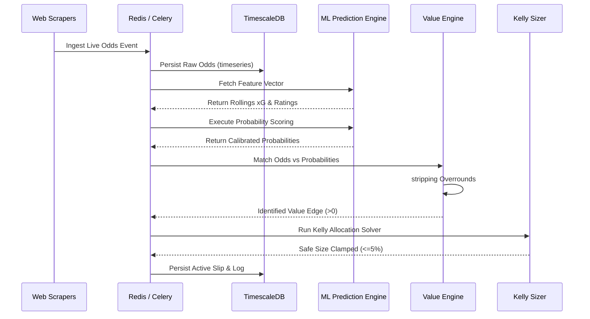

# 🦾 Enterprise Architecture: Module Interactions & Sequence Flows

## 📋 Governance & Control Metadata
- **Status**: APPROVED (Enterprise Standard)
- **Review Frequency**: Bi-annual
- **Owner**: Principal Software Architect
- **Cross References**: bounded-contexts, backend-architecture, api-architecture
- **Revision History**:
- `v1.0.0` (2026-06-29): Initial baseline Module Interactions specification.

---

## 🎯 1. Purpose & Objectives
Provides clear visual blueprints detailing how independent modules interact to complete complex business flows.

---

## 🔍 2. Scope & Applicability
Applies to all software engineering integrations and sequence validations.

---

## 🏢 3. Structural Responsibilities
- **Responsibility**: Expose execution sequences across scrapers, database, ML ensemblers, sizers, and user dashboards.
- **Responsibility**: Identify race conditions and define synchronous vs asynchronous processing bounds.
- **Responsibility**: Provide trace blueprints to debug pipeline errors.

---

## 🎨 4. Core Design Principles
- **Design Principle**: Async by Default: High-overhead tasks (scraping, model retraining) must run asynchronously in background queues.
- **Design Principle**: Symmetric Communication: Return rapid HTTP acknowledgments and process heavy computational loops out-of-band.

---

## 🛠️ 5. Architectural Decisions (ADR Alignment)
- **Architectural Decision**: Use Redis as an intermediate high-speed event cache and message broker between FastAPI and Celery.
- **Architectural Decision**: Broadcast real-time execution states via secure WebSockets directly to active user interfaces.

---

## 📊 6. Architectural Diagrams

### ⚡ Core Ingest to Value Bet Flow

---

## 💡 8. Implementation Best Practices
- **Best Practice**: Ensure every multi-module flow includes a correlation ID passed across all network boundaries.
- **Best Practice**: Always implement idempotent task handlers to safely recover from midway pipeline crashes.

---

## ❌ 9. Architectural Anti-patterns
- **Anti-Pattern**: Running sports analytics model training or predictions inside synchronous API request-response loops.
- **Anti-Pattern**: Blocking scrapper processes while waiting for prediction engines to compute probabilities.

---

## 🔒 10. Security & Threat Considerations
- **Boundary Controls**: Strict ingress-egress filtering and validation on all interaction pathways.
- **Identity & Access**: Zero-trust approach to internal calls and API authentication.
- **Security Posture**: Tracing interactions validates that unauthorized requests cannot hijack internal sizer parameters.

---

## ⚡ 11. Performance Considerations
- **Execution Budget**: Low-latency benchmarks targeting p95 boundaries.
- **Caching & Caching Strategy**: Read-aside cache patterns combined with transactional isolation.
- **Performance Details**: Decoupled asynchronous interactions keep API gateways responsive under concurrent load surges.

---

## 📈 12. Scalability Considerations
- **Horizontal Scaling**: Stateless execution nodes capable of elastic growth.
- **Data Scaling**: TimescaleDB partitioning and query-read-replica isolation.
- **Scalability Details**: Permits horizontal scaling of scrapers or prediction workers without modifying the central API gateway.

---

## 🧪 13. Comprehensive Testing Strategy
- **Unit Boundary Verification**: 100% logic coverage of calculations and data formats.
- **Integration & Validation Paths**: End-to-end sandbox simulations validating pipeline integrity.
- **Testing Approach**: Sequence models facilitate clear stubbing configurations during integration test suites.

---

## 🔧 14. Operational Considerations
- **Logging & Visibility**: Structured JSON logs emitted directly to log aggregation collectors.
- **Alerting thresholds**: SRE metrics integrated with Slack/Telegram escalation schedules.
- **Operational Details**: Trace interactions on distributed APM dashboards using unified trace and span identifiers.

---

## ⚠️ 15. Common Architectural Mistakes
- **Execution Mistake**: Forgetting to propagate trace headers through Celery task parameters.
- **Execution Mistake**: Triggering duplicate prediction tasks for the same match due to un-deduplicated scraping events.

---

## 🚀 16. Continuous Future Improvements
- **Future Improvement**: Adopt OpenTelemetry tracing standards system-wide.
- **Future Improvement**: Introduce automatic retry with exponential backoff on all inter-module REST requests.

---

## 🕵️ 17. Architecture Review Checklist
- [ ] **Verify**: Confirm all sequence paths have matching trace ID propagation rules.
- [ ] **Verify**: Verify that all background tasks have configurable, non-blocking timeout limits.

---

## 🔗 18. References & Linked Resources
- [bounded-contexts](bounded-contexts.md)
- [backend-architecture](backend-architecture.md)
- [api-architecture](api-architecture.md)
