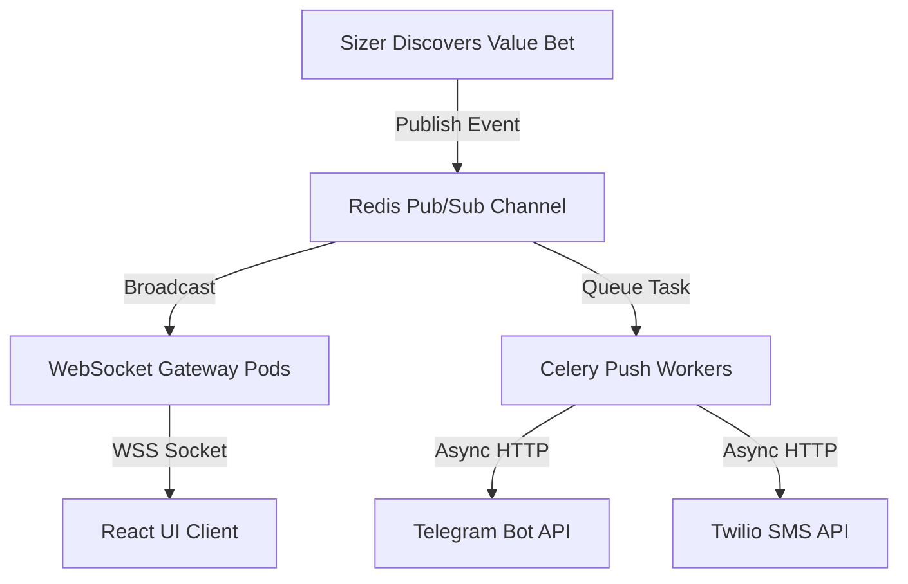

# 🦾 Enterprise Architecture: Notification & Alerting Engine Specification

## 📋 Governance & Control Metadata
- **Status**: APPROVED (Enterprise Standard)
- **Review Frequency**: Bi-annual
- **Owner**: Principal Software Architect
- **Cross References**: module-interactions, api-architecture, event-driven
- **Revision History**:
- `v1.0.0` (2026-06-29): Initial baseline Notification spec.

---

## 🎯 1. Purpose & Objectives
Exposes how the platform dispatches high-speed value bet alerts across multiple channels.

---

## 🔍 2. Scope & Applicability
Unified alerting standard across backend and integration layers.

---

## 🏢 3. Structural Responsibilities
- **Responsibility**: Deliver real-time value bet notifications with sub-second latencies.
- **Responsibility**: Format alerts dynamically matching target channels (SMS, WebSockets, Telegram channels).
- **Responsibility**: Manage user subscription topics and throttling limits to prevent spamming.

---

## 🎨 4. Core Design Principles
- **Design Principle**: Instant Delivery: High-value opportunities must route immediately before odds expire.
- **Design Principle**: Topic-Driven: Alert systems must use publish-subscribe patterns to easily isolate targets.

---

## 🛠️ 5. Architectural Decisions (ADR Alignment)
- **Architectural Decision**: Deploy Redis Pub/Sub as the main messaging broker for WebSocket connections.
- **Architectural Decision**: Leverage async webhook managers to deliver third-party (Telegram, SMS) alerts out-of-band.

---

## 📊 6. Architectural Diagrams

---

## 💡 8. Implementation Best Practices
- **Best Practice**: Deduplicate alerts targeting the same value bet across overlapping channels.
- **Best Practice**: Configure automatic fallback mechanisms if a primary channel provider (e.g., SMS Gateway) fails.

---

## ❌ 9. Architectural Anti-patterns
- **Anti-Pattern**: Blocking core sizer processes while waiting for Telegram or Email API acknowledgments.
- **Anti-Pattern**: Sending raw JSON debug payloads directly inside public user channels.

---

## 🔒 10. Security & Threat Considerations
- **Boundary Controls**: Strict ingress-egress filtering and validation on all interaction pathways.
- **Identity & Access**: Zero-trust approach to internal calls and API authentication.
- **Security Posture**: Alert templates are strictly filtered to prevent cross-site scripting (XSS) or arbitrary code execution.

---

## ⚡ 11. Performance Considerations
- **Execution Budget**: Low-latency benchmarks targeting p95 boundaries.
- **Caching & Caching Strategy**: Read-aside cache patterns combined with transactional isolation.
- **Performance Details**: Deliver notifications across all channels in less than 200ms from the instant of value bet discovery.

---

## 📈 12. Scalability Considerations
- **Horizontal Scaling**: Stateless execution nodes capable of elastic growth.
- **Data Scaling**: TimescaleDB partitioning and query-read-replica isolation.
- **Scalability Details**: WebSocket connections are distributed across multiple state-free gateway pods behind a sticky-load balancer.

---

## 🧪 13. Comprehensive Testing Strategy
- **Unit Boundary Verification**: 100% logic coverage of calculations and data formats.
- **Integration & Validation Paths**: End-to-end sandbox simulations validating pipeline integrity.
- **Testing Approach**: Notification modules are tested using sandbox mock configurations to prevent charging real API balances.

---

## 🔧 14. Operational Considerations
- **Logging & Visibility**: Structured JSON logs emitted directly to log aggregation collectors.
- **Alerting thresholds**: SRE metrics integrated with Slack/Telegram escalation schedules.
- **Operational Details**: Alert metrics track delivery latency, delivery success rates, and outstanding active WebSocket connections.

---

## ⚠️ 15. Common Architectural Mistakes
- **Execution Mistake**: Triggering duplicate alerts for minor bookmaker odds fluctuations.
- **Execution Mistake**: Failing to clean up inactive WebSocket client connections, causing high server memory bloat.

---

## 🚀 16. Continuous Future Improvements
- **Future Improvement**: Deploy automated AI-powered alert summaries customizing notifications based on individual user styles.
- **Future Improvement**: Support localized language formatting for international alerts.

---

## 🕵️ 17. Architecture Review Checklist
- [ ] **Verify**: Verify that all external API integrations utilize non-blocking async network calls.
- [ ] **Verify**: Confirm that the Telegram bot credentials are encrypted inside the environment config.

---

## 🔗 18. References & Linked Resources
- [module-interactions](module-interactions.md)
- [api-architecture](api-architecture.md)
- [event-driven](event-driven.md)
