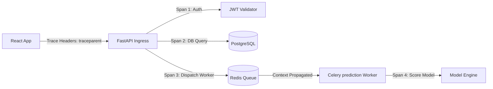

# 🦾 Enterprise Architecture: Observability & Distributed Tracing Specification

## 📋 Governance & Control Metadata
- **Status**: APPROVED (Enterprise Standard)
- **Review Frequency**: Bi-annual
- **Owner**: Principal Software Architect
- **Cross References**: logging, monitoring, backend-architecture
- **Revision History**:
- `v1.0.0` (2026-06-29): Initial baseline Observability blueprint.

---

## 🎯 1. Purpose & Objectives
Exposes how the platform implements open telemetry, context propagation, and error tracing.

---

## 🔍 2. Scope & Applicability
Universal standard for distributed tracing and Sentry error telemetry.

---

## 🏢 3. Structural Responsibilities
- **Responsibility**: Capture end-to-end execution spans across APIs, databases, Celery queues, and scrapers.
- **Responsibility**: Propagate trace context parameters across asynchronous processing boundaries.
- **Responsibility**: Capture unhandled exception traces and report details to central debugging panels.

---

## 🎨 4. Core Design Principles
- **Design Principle**: Full Visibility: Trace every request from client click to database write.
- **Design Principle**: Context Preservation: Never drop trace headers when crossing asynchronous network bounds.

---

## 🛠️ 5. Architectural Decisions (ADR Alignment)
- **Architectural Decision**: Adopt OpenTelemetry as the standardized tracing format.
- **Architectural Decision**: Integrate Sentry to capture client and server errors dynamically.

---

## 📊 6. Architectural Diagrams

---

## 💡 8. Implementation Best Practices
- **Best Practice**: Include trace and span IDs in all log lines to enable rapid cross-referencing.
- **Best Practice**: Configure tracing sampling parameters dynamically to control storage cost bounds.

---

## ❌ 9. Architectural Anti-patterns
- **Anti-Pattern**: Failing to propagate trace context parameters across celery worker calls.
- **Anti-Pattern**: Failing to capture database query execution spans inside tracing panels.

---

## 🔒 10. Security & Threat Considerations
- **Boundary Controls**: Strict ingress-egress filtering and validation on all interaction pathways.
- **Identity & Access**: Zero-trust approach to internal calls and API authentication.
- **Security Posture**: Tracing payloads are parsed, filtering out customer credentials, API keys, and personal info.

---

## ⚡ 11. Performance Considerations
- **Execution Budget**: Low-latency benchmarks targeting p95 boundaries.
- **Caching & Caching Strategy**: Read-aside cache patterns combined with transactional isolation.
- **Performance Details**: OpenTelemetry collectors utilize asynchronous UDP protocols to export traces without blocking active thread processes.

---

## 📈 12. Scalability Considerations
- **Horizontal Scaling**: Stateless execution nodes capable of elastic growth.
- **Data Scaling**: TimescaleDB partitioning and query-read-replica isolation.
- **Scalability Details**: Distributed traces facilitate localization of slow services inside complex microservice systems.

---

## 🧪 13. Comprehensive Testing Strategy
- **Unit Boundary Verification**: 100% logic coverage of calculations and data formats.
- **Integration & Validation Paths**: End-to-end sandbox simulations validating pipeline integrity.
- **Testing Approach**: Traces are validated during integration test loops, verifying correct span links.

---

## 🔧 14. Operational Considerations
- **Logging & Visibility**: Structured JSON logs emitted directly to log aggregation collectors.
- **Alerting thresholds**: SRE metrics integrated with Slack/Telegram escalation schedules.
- **Operational Details**: APM dashboards provide deep visualization of system bottlenecks.

---

## ⚠️ 15. Common Architectural Mistakes
- **Execution Mistake**: Setting the tracing sample rate to 100% on high-frequency live markets, generating huge storage bills.
- **Execution Mistake**: Ignoring Sentry alert spikes, treating errors as benign noise.

---

## 🚀 16. Continuous Future Improvements
- **Future Improvement**: Implement real-time visual tracing maps on the developer dashboard.
- **Future Improvement**: Support automatic trace correlation with active git commit histories.

---

## 🕵️ 17. Architecture Review Checklist
- [ ] **Verify**: Verify that Sentry is initialized correctly on both React client and Python backend.
- [ ] **Verify**: Confirm that trace propagation headers are included in all asynchronous Celery payloads.

---

## 🔗 18. References & Linked Resources
- [logging](logging.md)
- [monitoring](monitoring.md)
- [backend-architecture](backend-architecture.md)
