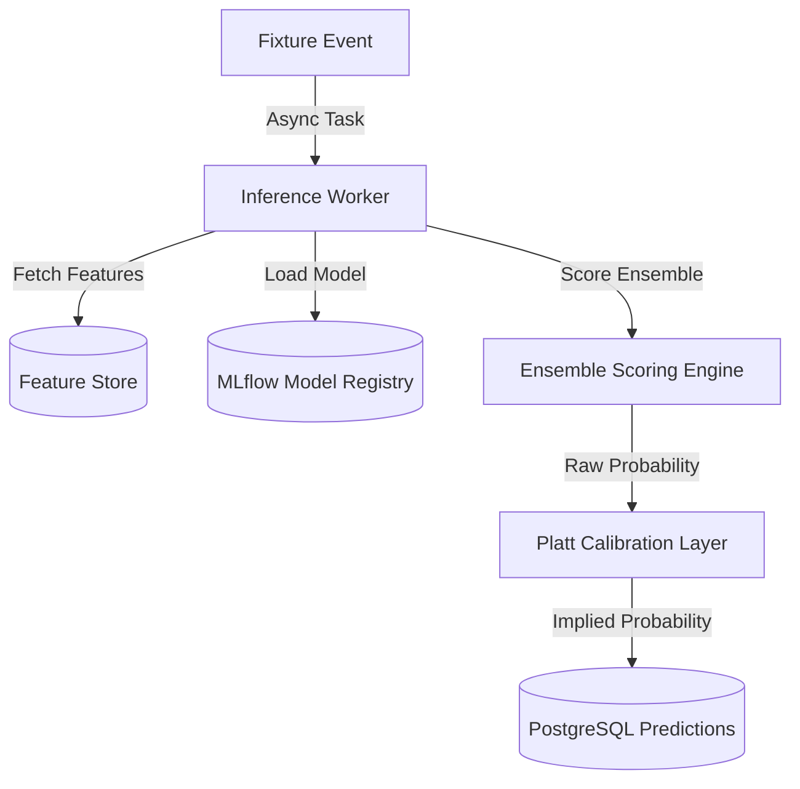

# 🦾 Enterprise Architecture: Real-Time Prediction Pipeline & Scoring Engine

## 📋 Governance & Control Metadata
- **Status**: APPROVED (Enterprise Standard)
- **Review Frequency**: Bi-annual
- **Owner**: Principal Software Architect
- **Cross References**: prediction-engine, feature-engineering, data-ingestion
- **Revision History**:
- `v1.0.0` (2026-06-29): Initial baseline Prediction Pipeline specification.

---

## 🎯 1. Purpose & Objectives
Exposes how the platform scores fixtures in real-time, executing feature extractions, model evaluation, and calibration.

---

## 🔍 2. Scope & Applicability
Universal specification for active predictive systems and scoring services.

---

## 🏢 3. Structural Responsibilities
- **Responsibility**: Trigger inference runs automatically when new fixtures or odds updates are received.
- **Responsibility**: Extract dynamic forms and team performance variables from active feature stores.
- **Responsibility**: Format and calibrate raw model predictions into implied probabilities.

---

## 🎨 4. Core Design Principles
- **Design Principle**: Sub-Second Inference: Implied model probabilities must update instantly to capture active market value.
- **Design Principle**: Calibration Governance: Raw outputs must always pass calibration layers (e.g. Platt Scaling) before use.

---

## 🛠️ 5. Architectural Decisions (ADR Alignment)
- **Architectural Decision**: Execute inference loops asynchronously inside Celery task workers to avoid API delays.
- **Architectural Decision**: Store predictions directly in Relational Databases alongside feature version tags to support future calibration audits.

---

## 📊 6. Architectural Diagrams

---

## 💡 8. Implementation Best Practices
- **Best Practice**: Use pre-compiled or serialized model files (e.g. JSON or ONNX) to speed up load times.
- **Best Practice**: Incorporate fallback values for team form parameters when evaluating new teams with limited history.

---

## ❌ 9. Architectural Anti-patterns
- **Anti-Pattern**: Evaluating predictions inside core real-time HTTP server threads.
- **Anti-Pattern**: Applying uncalibrated model outputs directly to bankroll sizer engines.

---

## 🔒 10. Security & Threat Considerations
- **Boundary Controls**: Strict ingress-egress filtering and validation on all interaction pathways.
- **Identity & Access**: Zero-trust approach to internal calls and API authentication.
- **Security Posture**: Inference workers run inside locked secure subnets with zero public ingress paths.

---

## ⚡ 11. Performance Considerations
- **Execution Budget**: Low-latency benchmarks targeting p95 boundaries.
- **Caching & Caching Strategy**: Read-aside cache patterns combined with transactional isolation.
- **Performance Details**: Completes calculations in <12ms, allowing high throughput processing on live feeds.

---

## 📈 12. Scalability Considerations
- **Horizontal Scaling**: Stateless execution nodes capable of elastic growth.
- **Data Scaling**: TimescaleDB partitioning and query-read-replica isolation.
- **Scalability Details**: Inference nodes scale out elastically, handling thousands of concurrent matches.

---

## 🧪 13. Comprehensive Testing Strategy
- **Unit Boundary Verification**: 100% logic coverage of calculations and data formats.
- **Integration & Validation Paths**: End-to-end sandbox simulations validating pipeline integrity.
- **Testing Approach**: Validated using test suites to confirm that identical inputs always return identical probabilities.

---

## 🔧 14. Operational Considerations
- **Logging & Visibility**: Structured JSON logs emitted directly to log aggregation collectors.
- **Alerting thresholds**: SRE metrics integrated with Slack/Telegram escalation schedules.
- **Operational Details**: Operational alerts trigger if prediction pipelines fail to run on active scheduled fixtures.

---

## ⚠️ 15. Common Architectural Mistakes
- **Execution Mistake**: Using outdated feature parameters, causing outdated prediction calculations.
- **Execution Mistake**: Omitting form fallbacks, crashing when encountering newly promoted teams.

---

## 🚀 16. Continuous Future Improvements
- **Future Improvement**: Deploy localized ONNX runtime containers to maximize scoring speeds.
- **Future Improvement**: Support real-time prediction updates on live matches.

---

## 🕵️ 17. Architecture Review Checklist
- [ ] **Verify**: Verify that all predictions include explicit model and feature version labels.
- [ ] **Verify**: Confirm that the calibration layer is active on all prediction output paths.

---

## 🔗 18. References & Linked Resources
- [prediction-engine](prediction-engine.md)
- [feature-engineering](feature-engineering.md)
- [data-ingestion](data-ingestion.md)
