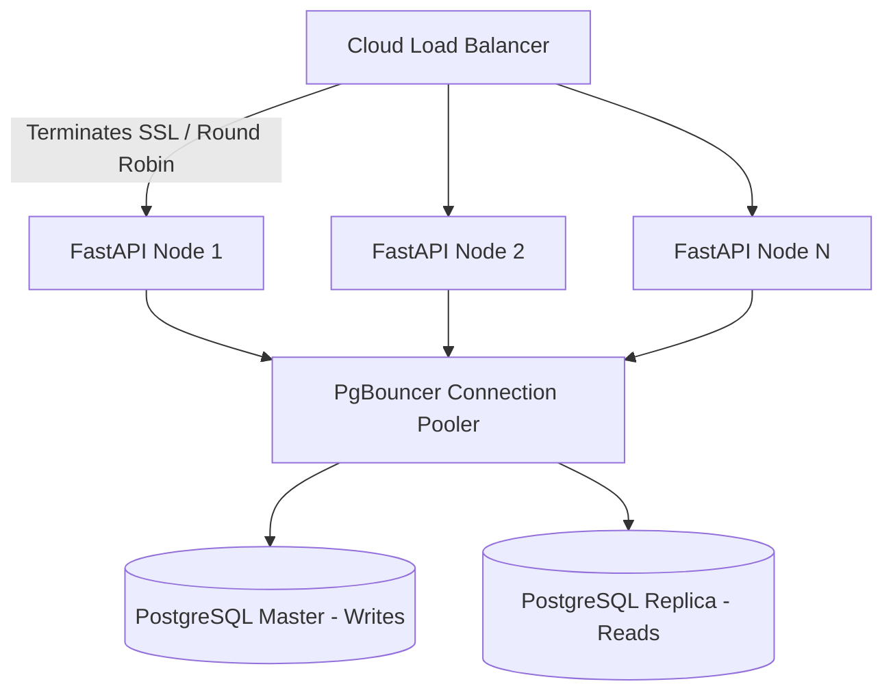

# 🦾 Enterprise Architecture: Scalability & Load Balancer Reference

## 📋 Governance & Control Metadata
- **Status**: APPROVED (Enterprise Standard)
- **Review Frequency**: Bi-annual
- **Owner**: Principal Software Architect
- **Cross References**: system-overview, database-architecture, infrastructure
- **Revision History**:
- `v1.0.0` (2026-06-29): Initial baseline Scalability specification.

---

## 🎯 1. Purpose & Objectives
Exposes how the platform handles massive odds ingestion spikes and scales to thousands of concurrent users.

---

## 🔍 2. Scope & Applicability
Blueprint for infrastructure designers and devops engineers.

---

## 🏢 3. Structural Responsibilities
- **Responsibility**: Design stateless, horizontally scalable container topologies.
- **Responsibility**: Configure auto-scaling thresholds and load balancing rules.
- **Responsibility**: Optimize database scaling parameters (read-replicas, connection pooling).

---

## 🎨 4. Core Design Principles
- **Design Principle**: Stateless Core: API nodes must store zero session states, enabling elastic, multi-region scaling.
- **Design Principle**: Dynamic Auto-scaling: Scale resources based on actual demand metrics (CPU, queue backlog).

---

## 🛠️ 5. Architectural Decisions (ADR Alignment)
- **Architectural Decision**: Deploy stateless container instances on GCP Cloud Run.
- **Architectural Decision**: Configure auto-scaling triggers based on target CPU utilization (set at 70%).

---

## 📊 6. Architectural Diagrams

---

## 💡 8. Implementation Best Practices
- **Best Practice**: Utilize read-replicas for all heavy read operations (reporting, dashboard history charts).
- **Best Practice**: Deploy caching layers (Redis) to decouple hot endpoints from core relational databases.

---

## ❌ 9. Architectural Anti-patterns
- **Anti-Pattern**: Scaling databases vertically instead of utilizing connection pooling and read-replicas.
- **Anti-Pattern**: Using local container storage for persistent assets.

---

## 🔒 10. Security & Threat Considerations
- **Boundary Controls**: Strict ingress-egress filtering and validation on all interaction pathways.
- **Identity & Access**: Zero-trust approach to internal calls and API authentication.
- **Security Posture**: Load balancers terminate SSL certificates, restricting access to secure HTTPS/WSS protocols.

---

## ⚡ 11. Performance Considerations
- **Execution Budget**: Low-latency benchmarks targeting p95 boundaries.
- **Caching & Caching Strategy**: Read-aside cache patterns combined with transactional isolation.
- **Performance Details**: Maintains low API latency under concurrent load surges by distributing traffic evenly across active nodes.

---

## 📈 12. Scalability Considerations
- **Horizontal Scaling**: Stateless execution nodes capable of elastic growth.
- **Data Scaling**: TimescaleDB partitioning and query-read-replica isolation.
- **Scalability Details**: Proven horizontal scaling, dynamically expanding from 2 to 50+ API nodes in under 2 minutes.

---

## 🧪 13. Comprehensive Testing Strategy
- **Unit Boundary Verification**: 100% logic coverage of calculations and data formats.
- **Integration & Validation Paths**: End-to-end sandbox simulations validating pipeline integrity.
- **Testing Approach**: Validated via regular load testing runs (using Locust) to find and fix system limits.

---

## 🔧 14. Operational Considerations
- **Logging & Visibility**: Structured JSON logs emitted directly to log aggregation collectors.
- **Alerting thresholds**: SRE metrics integrated with Slack/Telegram escalation schedules.
- **Operational Details**: Monitors horizontal pod count, load balancer latencies, and auto-scaling events.

---

## ⚠️ 15. Common Architectural Mistakes
- **Execution Mistake**: Hardcoding connection counts in server scripts, causing connection pool exhaustion during scale-out events.
- **Execution Mistake**: Failing to scale background workers, causing massive message queues during match spikes.

---

## 🚀 16. Continuous Future Improvements
- **Future Improvement**: Deploy multi-region load balancers to minimize global user latencies.
- **Future Improvement**: Incorporate serverless databases to scale storage dynamically.

---

## 🕵️ 17. Architecture Review Checklist
- [ ] **Verify**: Verify that all API endpoints are fully stateless.
- [ ] **Verify**: Confirm that PgBouncer is configured correctly to pool database connections.

---

## 🔗 18. References & Linked Resources
- [system-overview](system-overview.md)
- [database-architecture](database-architecture.md)
- [infrastructure](infrastructure.md)
