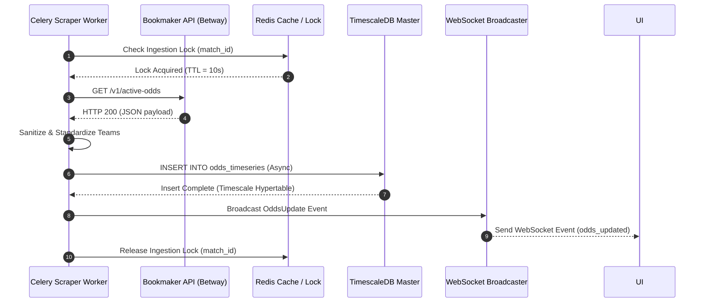
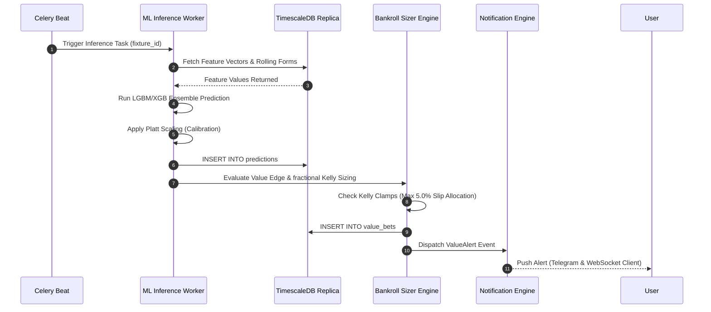

# 🦾 Enterprise Architecture: System Sequence Diagrams

## 📋 Governance & Control Metadata
- **Status**: APPROVED (Enterprise Standard)
- **Review Frequency**: Bi-annual
- **Owner**: Principal Software Architect
- **Cross References**: module-interactions, api-architecture, event-driven
- **Revision History**:
- `v1.0.0` (2026-06-29): Initial baseline Sequence Diagrams released.

---

## 🎯 1. Purpose & Objectives
Exposes complete, high-fidelity visual interaction sequences across all platform workflows.

---

## 🔍 2. Scope & Applicability
Universal visualization standard for complex system interactions.

---

## 🏢 3. Structural Responsibilities
- **Responsibility**: Provide clear, detailed sequence representations for prediction generation, odds scraping, and slip settling.
- **Responsibility**: Visualize async processing steps, Redis event loops, and WebSocket updates.
- **Responsibility**: Serve as the baseline guide to trace pipeline communication paths.

---

## 🎨 4. Core Design Principles
- **Design Principle**: Visual Clarity: Keep sequence diagrams scannable, detailed, and perfectly matching actual code behaviors.
- **Design Principle**: Detailed Labeling: Every arrow must define a concrete action, protocol (HTTP/REST, WS, PubSub), and return payload.

---

## 🛠️ 5. Architectural Decisions (ADR Alignment)
- **Architectural Decision**: Model all sequence diagrams inside Mermaid to facilitate in-line updates.
- **Architectural Decision**: Ensure every key system workflow is visually represented.

---

## 📊 6. Architectural Diagrams

### ⚡ High-Fidelity Odds Scraping & DB Ingest Sequence

### 🎯 Machine Learning Inference & Value Bet Pipeline Sequence

---

## 💡 8. Implementation Best Practices
- **Best Practice**: Group related interactions into clean logical blocks.
- **Best Practice**: Regularly update diagrams to reflect modifications to backend service endpoints.

---

## ❌ 9. Architectural Anti-patterns
- **Anti-Pattern**: Designing conceptual sequence diagrams that do not match the actual code communication steps.
- **Anti-Pattern**: Omitting error or exception paths from interaction charts.

---

## 🔒 10. Security & Threat Considerations
- **Boundary Controls**: Strict ingress-egress filtering and validation on all interaction pathways.
- **Identity & Access**: Zero-trust approach to internal calls and API authentication.
- **Security Posture**: Validates that security validations are handled at the correct steps during system interactions.

---

## ⚡ 11. Performance Considerations
- **Execution Budget**: Low-latency benchmarks targeting p95 boundaries.
- **Caching & Caching Strategy**: Read-aside cache patterns combined with transactional isolation.
- **Performance Details**: Identifies redundant network calls and database queries inside sequence paths.

---

## 📈 12. Scalability Considerations
- **Horizontal Scaling**: Stateless execution nodes capable of elastic growth.
- **Data Scaling**: TimescaleDB partitioning and query-read-replica isolation.
- **Scalability Details**: Decoupled sequence steps facilitate microservice migrations.

---

## 🧪 13. Comprehensive Testing Strategy
- **Unit Boundary Verification**: 100% logic coverage of calculations and data formats.
- **Integration & Validation Paths**: End-to-end sandbox simulations validating pipeline integrity.
- **Testing Approach**: Sequence paths guide integration testing scenarios.

---

## 🔧 14. Operational Considerations
- **Logging & Visibility**: Structured JSON logs emitted directly to log aggregation collectors.
- **Alerting thresholds**: SRE metrics integrated with Slack/Telegram escalation schedules.
- **Operational Details**: Helps SREs identify and trace bottlenecks inside multi-tier workflows.

---

## ⚠️ 15. Common Architectural Mistakes
- **Execution Mistake**: Failing to represent connection failure paths.
- **Execution Mistake**: Mixing conceptual business views with actual software execution details.

---

## 🚀 16. Continuous Future Improvements
- **Future Improvement**: Deploy automated tools to generate visual traces from active server transactions.
- **Future Improvement**: Support dynamic dependency visualizations on SRE consoles.

---

## 🕵️ 17. Architecture Review Checklist
- [ ] **Verify**: Verify that the sequence diagrams match the active backend endpoints.
- [ ] **Verify**: Confirm all asynchronous worker steps are correctly highlighted.

---

## 🔗 18. References & Linked Resources
- [module-interactions](module-interactions.md)
- [api-architecture](api-architecture.md)
- [event-driven](event-driven.md)
