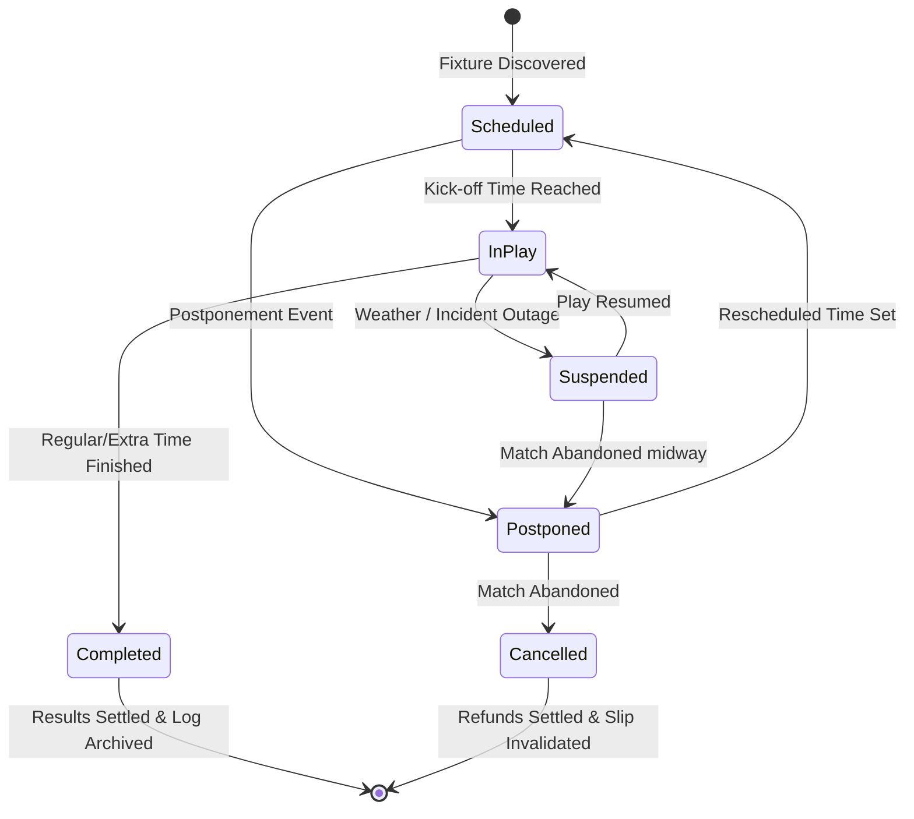
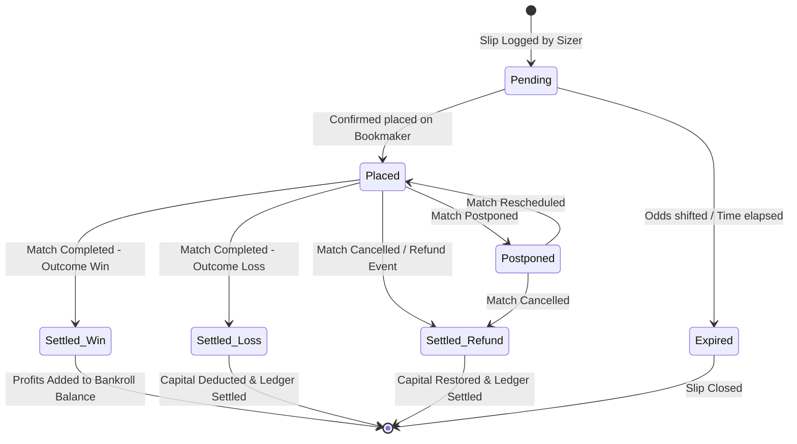

# 🦾 Enterprise Architecture: Platform State Machines

## 📋 Governance & Control Metadata
- **Status**: APPROVED (Enterprise Standard)
- **Review Frequency**: Bi-annual
- **Owner**: Principal Software Architect
- **Cross References**: database-architecture, bankroll-engine, logging
- **Revision History**:
- `v1.0.0` (2026-06-29): Initial baseline State Machines released.

---

## 🎯 1. Purpose & Objectives
Exposes standard lifecycles, states, and transition rules for key platform aggregates.

---

## 🔍 2. Scope & Applicability
Universal standard for state transitions and validation rules.

---

## 🏢 3. Structural Responsibilities
- **Responsibility**: Define finite state machines for fixtures, predictions, value bets, and user slips.
- **Responsibility**: Enforce transition rules, blocking invalid status changes (e.g., settling a pending slip before kick-off).
- **Responsibility**: Log state transition histories to preserve comprehensive audits.

---

## 🎨 4. Core Design Principles
- **Design Principle**: Deterministic Transitions: State changes must be driven by strict, validated event triggers.
- **Design Principle**: Auditability: Every state change must record a corresponding event timestamp and user/worker ID.

---

## 🛠️ 5. Architectural Decisions (ADR Alignment)
- **Architectural Decision**: Model state machines inside database schema validations and application models.
- **Architectural Decision**: Publish state transition events asynchronously to inform dependent microservices.

---

## 📊 6. Architectural Diagrams

### ⚽ Match Fixture Lifecycle State Machine

### 🎟️ User Trading Slip Lifecycle State Machine

---

## 💡 8. Implementation Best Practices
- **Best Practice**: Validate state transitions inside database transaction blocks.
- **Best Practice**: Enforce safe default states (e.g., Fixtures default to "Scheduled", Slips default to "Pending").

---

## ❌ 9. Architectural Anti-patterns
- **Anti-Pattern**: Updating state values directly in memory without checking active transition rules.
- **Anti-Pattern**: Failing to handle terminal states, allowing settled records to re-enter active loops.

---

## 🔒 10. Security & Threat Considerations
- **Boundary Controls**: Strict ingress-egress filtering and validation on all interaction pathways.
- **Identity & Access**: Zero-trust approach to internal calls and API authentication.
- **Security Posture**: Prevents fraudulent or malicious state changes, protecting financial assets and transaction audits.

---

## ⚡ 11. Performance Considerations
- **Execution Budget**: Low-latency benchmarks targeting p95 boundaries.
- **Caching & Caching Strategy**: Read-aside cache patterns combined with transactional isolation.
- **Performance Details**: Transitions execute instantly in database blocks, avoiding synchronization delays.

---

## 📈 12. Scalability Considerations
- **Horizontal Scaling**: Stateless execution nodes capable of elastic growth.
- **Data Scaling**: TimescaleDB partitioning and query-read-replica isolation.
- **Scalability Details**: Decoupled event triggers allow horizontal scaling of state-monitoring services.

---

## 🧪 13. Comprehensive Testing Strategy
- **Unit Boundary Verification**: 100% logic coverage of calculations and data formats.
- **Integration & Validation Paths**: End-to-end sandbox simulations validating pipeline integrity.
- **Testing Approach**: Tested using state-transition assertion checks, verifying correct blocks on illegal movements.

---

## 🔧 14. Operational Considerations
- **Logging & Visibility**: Structured JSON logs emitted directly to log aggregation collectors.
- **Alerting thresholds**: SRE metrics integrated with Slack/Telegram escalation schedules.
- **Operational Details**: Operational metrics monitor state lifecycles and average duration in each state.

---

## ⚠️ 15. Common Architectural Mistakes
- **Execution Mistake**: Failing to handle postponed matches, leaving fixtures stuck in "Scheduled" state indefinitely.
- **Execution Mistake**: Letting slips get settled twice, duplicating payouts.

---

## 🚀 16. Continuous Future Improvements
- **Future Improvement**: Deploy automated state-monitoring alert systems.
- **Future Improvement**: Transition key state ledgers to immutable blockchains.

---

## 🕵️ 17. Architecture Review Checklist
- [ ] **Verify**: Confirm database models enforce strict state constraints.
- [ ] **Verify**: Verify that state changes generate corresponding audit log records.

---

## 🔗 18. References & Linked Resources
- [database-architecture](database-architecture.md)
- [bankroll-engine](bankroll-engine.md)
- [logging](logging.md)
