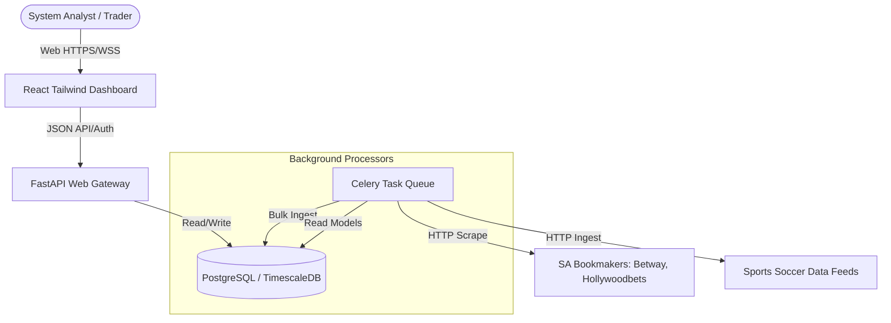
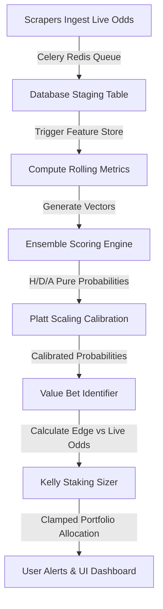

# 🦾 Enterprise Architecture: System Overview

## 📋 Governance & Control Metadata
- **Status**: APPROVED (Enterprise Standard)
- **Review Frequency**: Bi-annual
- **Owner**: Principal Software Architect
- **Cross References**: architecture-index, clean-architecture, bounded-contexts
- **Revision History**:
- `v1.0.0` (2026-06-29): Initial baseline system overview release.

---

## 🎯 1. Purpose & Objectives
Exposes the complete multi-tier sports analytics and probability modeling platform overview.

---

## 🔍 2. Scope & Applicability
Defines the general architectural, operational, and data pipelines.

---

## 🏢 3. Structural Responsibilities
- **Responsibility**: Define the high-level business goals (neutralize overrounds, identify pricing edges, size stakes).
- **Responsibility**: Structure the data flow from regional web scraping down to user execution dashboards.
- **Responsibility**: Establish the high-level boundaries between backend (Python) and frontend (React).

---

## 🎨 4. Core Design Principles
- **Design Principle**: Quantitative Financial Rigor: Treat sports selections strictly like financial derivatives arbitrage.
- **Design Principle**: Eventual Consistency: Odds ingest is high-frequency, but analytical reports update on a regular interval.
- **Design Principle**: Failsafe Allocation: Absolute security over bankroll capital; math rules above user hunches.

---

## 🛠️ 5. Architectural Decisions (ADR Alignment)
- **Architectural Decision**: Use Python FastAPI for high-throughput asynchronous API performance and typing via Pydantic.
- **Architectural Decision**: Deploy TimescaleDB on PostgreSQL to combine relational analytics with efficient timeseries performance.

---

## 📊 6. Architectural Diagrams

### 🌐 C4 Context Diagram

### 🔄 System Flowchart

---

## 💡 8. Implementation Best Practices
- **Best Practice**: Isolate the ingestion scrappers from prediction pipelines to prevent ingestion delays from blocking predictions.
- **Best Practice**: Always log calculations of value-bet edges alongside odds and probabilities to provide a full audit trail.

---

## ❌ 9. Architectural Anti-patterns
- **Anti-Pattern**: Direct coupling of web scrapers with ML models without database staging layers.
- **Anti-Pattern**: Bypassing the 5% portfolio risk threshold under any active operational conditions.

---

## 🔒 10. Security & Threat Considerations
- **Boundary Controls**: Strict ingress-egress filtering and validation on all interaction pathways.
- **Identity & Access**: Zero-trust approach to internal calls and API authentication.
- **Security Posture**: Encapsulate scrapers, ML training pipelines, and core database nodes behind private networking layers.

---

## ⚡ 11. Performance Considerations
- **Execution Budget**: Low-latency benchmarks targeting p95 boundaries.
- **Caching & Caching Strategy**: Read-aside cache patterns combined with transactional isolation.
- **Performance Details**: API routes resolve within 50ms, scraper loops run asynchronously using Celery and Redis event queues.

---

## 📈 12. Scalability Considerations
- **Horizontal Scaling**: Stateless execution nodes capable of elastic growth.
- **Data Scaling**: TimescaleDB partitioning and query-read-replica isolation.
- **Scalability Details**: Horizontally scalable container pods hosted in Cloud Run, leveraging DB write-read replica splits.

---

## 🧪 13. Comprehensive Testing Strategy
- **Unit Boundary Verification**: 100% logic coverage of calculations and data formats.
- **Integration & Validation Paths**: End-to-end sandbox simulations validating pipeline integrity.
- **Testing Approach**: Full integration testing replicating the ingestion, model scoring, and Kelly sizer execution pipeline.

---

## 🔧 14. Operational Considerations
- **Logging & Visibility**: Structured JSON logs emitted directly to log aggregation collectors.
- **Alerting thresholds**: SRE metrics integrated with Slack/Telegram escalation schedules.
- **Operational Details**: Prometheus metrics monitoring scraper rates, queue depths, API latencies, and prediction calibration metrics.

---

## ⚠️ 15. Common Architectural Mistakes
- **Execution Mistake**: Hardcoding bookmaker scrape target structures within the main database handlers.
- **Execution Mistake**: Failing to monitor Celery queue backlog, delaying odds updates.

---

## 🚀 16. Continuous Future Improvements
- **Future Improvement**: Integrate distributed caching across all active odds endpoints to reduce DB CPU loads.
- **Future Improvement**: Deploy real-time scraper health metrics detailing blockings or CAPTCHA triggers.

---

## 🕵️ 17. Architecture Review Checklist
- [ ] **Verify**: Confirm that the C4 Context Diagram accurately reflects the outer system dependencies.
- [ ] **Verify**: Verify that the data flow pipeline contains clear deduplication layers.

---

## 🔗 18. References & Linked Resources
- [architecture-index](architecture-index.md)
- [clean-architecture](clean-architecture.md)
- [bounded-contexts](bounded-contexts.md)
