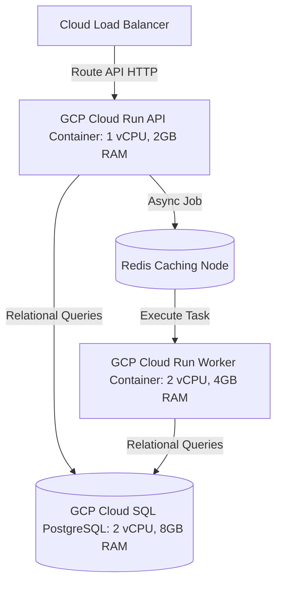

# 🦾 Enterprise Architecture: Global Systems Topology & Hardware Allocation

## 📋 Governance & Control Metadata
- **Status**: APPROVED (Enterprise Standard)
- **Review Frequency**: Bi-annual
- **Owner**: Principal Software Architect
- **Cross References**: system-overview, infrastructure, scalability
- **Revision History**:
- `v1.0.0` (2026-06-29): Initial baseline System specification.

---

## 🎯 1. Purpose & Objectives
Exposes hardware specs, container sizing, cloud zones, and physical network topologies.

---

## 🔍 2. Scope & Applicability
Unified system topology reference for operations and SRE teams.

---

## 🏢 3. Structural Responsibilities
- **Responsibility**: Specify cpu/memory boundaries for all platform container types.
- **Responsibility**: Configure database scaling profiles and read replica allocations.
- **Responsibility**: Define physical network layouts, separating public gateways from private workers.

---

## 🎨 4. Core Design Principles
- **Design Principle**: Optimal Allocation: Size containers based on real-world memory profiles, avoiding waste while maintaining safety margin.
- **Design Principle**: Decoupled Scaling: Scale independent workflows separately to optimize resource use.

---

## 🛠️ 5. Architectural Decisions (ADR Alignment)
- **Architectural Decision**: Standardize on 1 vCPU and 2GB Memory configurations for API containers, and 2 vCPU and 4GB Memory for ML inference workers.
- **Architectural Decision**: Utilize Google Cloud SQL for relational databases, allocating high-speed SSD storage.

---

## 📊 6. Architectural Diagrams

---

## 💡 8. Implementation Best Practices
- **Best Practice**: Maintain at least 30% safety margins when sizing active memory configurations.
- **Best Practice**: Configure automatic scale-out alerts to detect container resource exhaustion early.

---

## ❌ 9. Architectural Anti-patterns
- **Anti-Pattern**: Deploying resource-heavy ML workers inside identical small container pools as light API routers.
- **Anti-Pattern**: Omitting container memory caps, risking Out-Of-Memory (OOM) crashes.

---

## 🔒 10. Security & Threat Considerations
- **Boundary Controls**: Strict ingress-egress filtering and validation on all interaction pathways.
- **Identity & Access**: Zero-trust approach to internal calls and API authentication.
- **Security Posture**: All containers are run in private networks, restricting direct public internet ingress.

---

## ⚡ 11. Performance Considerations
- **Execution Budget**: Low-latency benchmarks targeting p95 boundaries.
- **Caching & Caching Strategy**: Read-aside cache patterns combined with transactional isolation.
- **Performance Details**: Sizing rules prevent container throttles, keeping response times consistent under load surges.

---

## 📈 12. Scalability Considerations
- **Horizontal Scaling**: Stateless execution nodes capable of elastic growth.
- **Data Scaling**: TimescaleDB partitioning and query-read-replica isolation.
- **Scalability Details**: Enables smooth, independent scaling of individual platform nodes.

---

## 🧪 13. Comprehensive Testing Strategy
- **Unit Boundary Verification**: 100% logic coverage of calculations and data formats.
- **Integration & Validation Paths**: End-to-end sandbox simulations validating pipeline integrity.
- **Testing Approach**: Sizing bounds are validated via regular synthetic load testing runs.

---

## 🔧 14. Operational Considerations
- **Logging & Visibility**: Structured JSON logs emitted directly to log aggregation collectors.
- **Alerting thresholds**: SRE metrics integrated with Slack/Telegram escalation schedules.
- **Operational Details**: Traces CPU usage, memory foot-print, network loads, and storage metrics across nodes.

---

## ⚠️ 15. Common Architectural Mistakes
- **Execution Mistake**: Setting database connection limits too low, blocking active worker nodes.
- **Execution Mistake**: Failing to monitor container throttles, leading to slow response times.

---

## 🚀 16. Continuous Future Improvements
- **Future Improvement**: Transition key services to serverless container networks.
- **Future Improvement**: Support automatic resource sizing based on ML-driven load predictors.

---

## 🕵️ 17. Architecture Review Checklist
- [ ] **Verify**: Verify that all containers specify explicit CPU and memory caps.
- [ ] **Verify**: Confirm database memory limits are sized correctly based on active dataset footprints.

---

## 🔗 18. References & Linked Resources
- [system-overview](system-overview.md)
- [infrastructure](infrastructure.md)
- [scalability](scalability.md)
