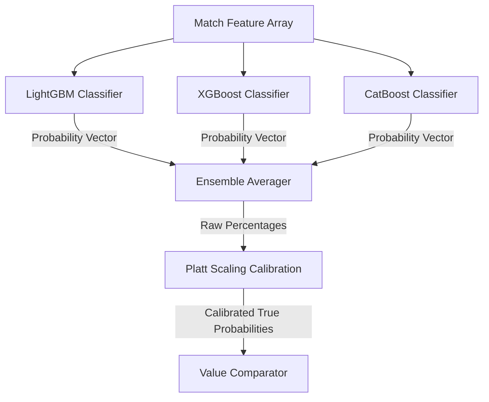

# 🧠 Machine Learning Models & Ensemble Pipelines

This manual documents the classification, regression, and model versioning pipelines.

---

## 🧠 Outcome Classification Ensembles

The platform leverages a multi-classifier ensemble to estimate Home-Draw-Away (HDA) probabilities:

---

## 📈 Model Training & Drift Evaluation

- **Time-Series Cross-Validation**: To avoid lookahead biases, models are evaluated on chronological splits. Past matches are never used to train on future results.
- **Model Drift Detection**: We run automated evaluation loops every Monday. If the log loss score on out-of-sample data increases by more than 0.05, the retraining pipeline is triggered automatically.
