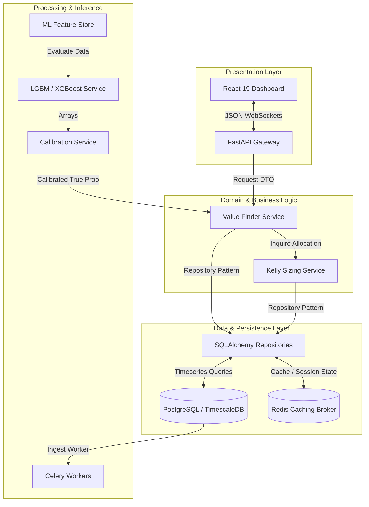

# 🏛️ Enterprise Multi-Layer Architectural Specification

This document details the layered, clean, and modular design of the platform, enforcing strict separation of concerns and database-driven decoupled states.



## 🏗️ Layered Architecture Boundaries

### 1. Presentation Layer (Vite / React 19)
- Completely decoupled, lightweight, static client bundle.
- Communicates exclusively over asynchronous HTTPS REST and WebSockets.
- Local state managed strictly via React hooks to avoid unnecessary re-renders.

### 2. API Gateway Layer (FastAPI)
- Exposes versioned paths (`/api/v1`) utilizing Pydantic models for incoming payload validation.
- Completely stateless; processes sessions and authentication via cryptographic JWT structures.
- Implements dependency injection for all data access repositories.

### 3. Domain & Application Layer
- Houses pure business rules: Kelly sizing logic, overround removal, and match result settlement algorithms.
- Contains 0 references to third-party frameworks, database drivers, or presentation configurations.

### 4. Infrastructure & Persistence Layer
- Encapsulates database drivers (SQLAlchemy, Alembic), redis connection clients, and scraping protocols.
- Implements the Repository Pattern, ensuring any controller querying data proceeds through an interface boundary.

---

## ⚡ Observability, Fault Tolerance & Disaster Recovery

- **Structured JSON Logging**: Every server process logs trace identifiers, execution metrics, and context properties in JSON format to facilitate instant debugging:
  ```json
  {"timestamp": "2026-06-28T22:42:35Z", "trace_id": "ab99-1223-aff6", "level": "INFO", "message": "Calculated value-betting slip", "edge": 0.144}
  ```
- **Database Backup Strategy**: Nightly logical backups saved to regional cloud object storage, with write-ahead logs (WAL) continuously streamed to replication nodes to guarantee a Recovery Point Objective (RPO) under 5 minutes.
- **Graceful Scraper Retries**: Celery tasks implement exponential backoff ($5s, 15s, 60s, 300s$) and automatic proxy rotations when hit with network errors or rate blocks.
