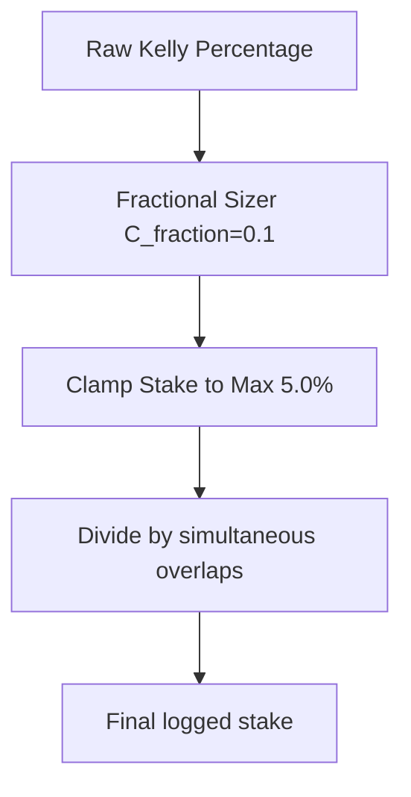

# 💰 Capital Preservation & Bankroll Management Sizing

This document details the portfolio sizing algorithms and risk constraints that protect capital from high-variance streaks.

---

## 🔢 Fractional Kelly Allocation Formula

Stakes are sized using a Fractional Kelly Criterion model:

$$f^* = \frac{b \cdot p - q}{b} \times C_{\text{fraction}}$$

*Where:*
- $b$: Decimal odds minus $1.0$.
- $p$: Calibrated model probability.
- $q$: Probability of loss ($1.0 - p$).
- $C_{\text{fraction}}$: Risk-tolerance coefficient clamped to $[0.1, 0.25]$.

---

## 🛡️ Staking Portfolio Constraints

- **Strict Max Stake Clamp**: No slip can recommend an allocation exceeding **5.0%** of total bankroll.
- **Overlap Adjustment**: During busy match days, the allocated Kelly fraction is adjusted based on overlap counts to prevent over-exposure.
