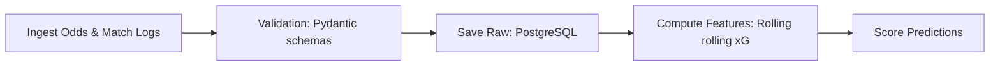

# 📊 Data Processing & Feature Engineering Ingestion

Detailed documentation on the ETL pipelines, data validations, and feature extraction layers.

---

## 🔄 ETL Pipeline Pipeline Flow

---

## 🧬 Feature Engineering Store

1. **Rolling Form Dynamics**: Computes weighted average goals, shots on target, and possession percentages over previous $k \in [3, 5, 10]$ matches.
2. **Rest Day Vectors**: Measures travel distance and resting day gaps between matches for each team.
3. **Rating Systems**: Implements Elo rating modifications adjusted for league and competitive depth.
