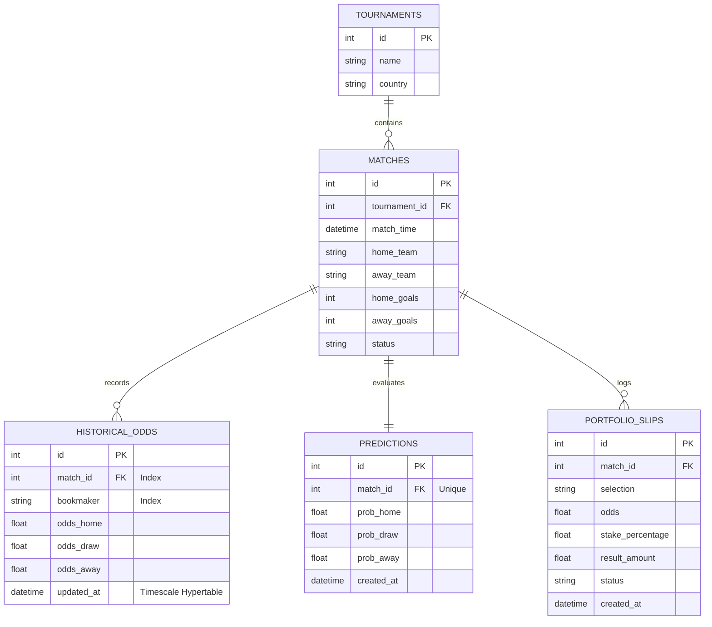

# 🗄️ Database Schema & Storage Engineering

We utilize a hybrid relational and time-series model powered by PostgreSQL and the TimescaleDB extension, optimizing historical logging of bookmaker odds alongside transactional relational entities.

---

## 🏛️ Schema Entity-Relationship Blueprint

---

## ⚙️ Naming Conventions & Database Standards

1. **Table Names**: Lowercase, plural, separated by underscores (e.g., `historical_odds`, `portfolio_slips`).
2. **Column Names**: Lowercase, singular snake_case (e.g., `match_time`, `stake_percentage`).
3. **Primary Keys**: Every relational table must define an autoincrementing integer primary key named `id`.
4. **Foreign Keys**: Must match parent table fields and end with `_id` (e.g., `tournament_id` references `tournaments.id`).
5. **Soft Deletion**: No physical rows are deleted from transactions, portfolios, or matches. Enforce an `is_deleted` boolean column and a default index constraint.

---

## ⚡ Indexing & Partitioning Strategy

- **TimescaleDB Hypertables**: The `historical_odds` table is configured as a TimescaleDB hypertable partitioned by the `updated_at` timestamp column in 7-day intervals.
- **Indices**:
  - `matches_tournament_id_match_time_idx`: Compound index to speed up tournament schedule lookups.
  - `historical_odds_match_id_bookmaker_updated_at_idx`: Composite index for real-time price trend comparisons.
  - `portfolio_slips_status_created_at_idx`: Speeds up active portfolio status listings.

---

## 🔀 Migration Protocol (Alembic)

All database adjustments must proceed through formal Alembic migrations:
1. Generate migration scripts using: `poetry run alembic revision -m "add_is_deleted_to_slips"`
2. Ensure backward compatibility by applying defaults before removing outdated columns.
3. Verify migrations against a development PostgreSQL docker replica before pushing.
