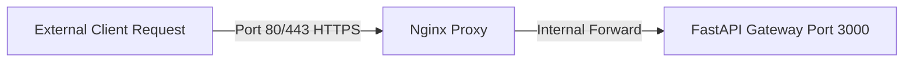

# 🐳 Deployment Architecture & Blue-Green Release Flow

We package and deploy containerized services onto secure Cloud instances using GitHub Actions pipelines.

---

## 🐳 Container Ingress Routing

All incoming external traffic is routed through a secure Nginx reverse proxy layer mapping exclusively to **Port 3000** on container ports.

---

## 🚀 Blue-Green Zero-Downtime Releases

To guarantee high availability, production deploys execute zero-downtime blue-green release swaps:
1. Spin up a new production-ready staging container ("Green") alongside the active container ("Blue").
2. Run health tests to confirm "Green" is responsive on port 3000.
3. Update proxy routing tables to forward all incoming traffic to "Green".
4. Shut down and reclaim memory from the older "Blue" instance.
