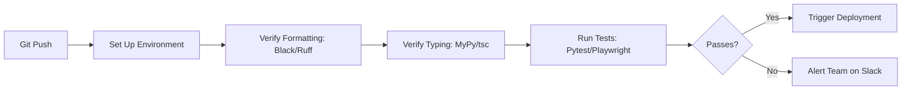

# 🚀 DevOps & Continuous Integration Pipelines

This manual documents the automated workflows, infrastructure monitoring, and CI pipelines for the platform.

---

## 🚀 Continuous Integration (GitHub Actions)

Every code push or PR automatically triggers our CI pipelines to verify style formatting, typing, and tests:

---

## 📊 Infrastructure Alerting & Metrics

- **System Metrics**: Monitored via Prometheus and visualized on Grafana.
- **Alert Triggers**: If API error rates exceed 2% or Celery task latency crosses 60s, automated alerts are sent to the engineering Slack channel immediately.
