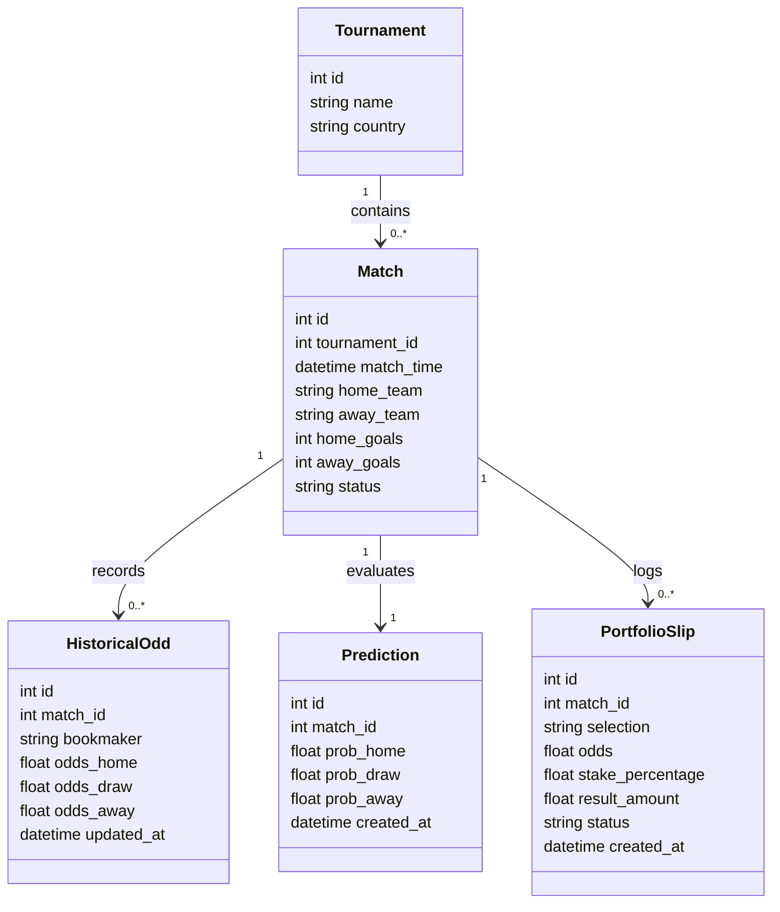
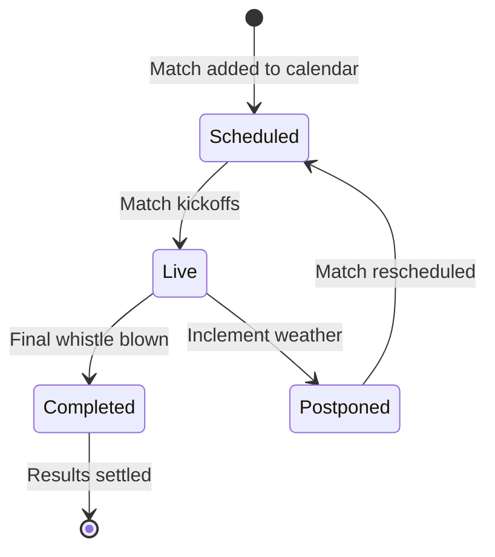
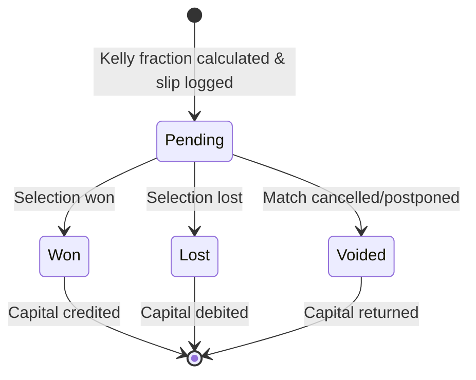

# 🧬 System Domain Models & Entities

This manual defines the structured data entities and relationship constraints within our sports analytics context.

---

## 🧬 Domain Entity Map

---

## 📝 Entity Lifecycles & State Transitions

### 1. Match State Lifecycle

### 2. Portfolio Slip Settlement Flow

---

## 🧩 Key Model Attributes

* **Tournament**: Groups competitive leagues (e.g., Premier Soccer League (PSL), English Premier League (EPL)).
* **Match**: Individual sport event, capturing competing teams, scheduling, and results.
* **HistoricalOdd**: Records timeseries price fluctuations. Contains values for Home win, Draw, and Away win.
* **Prediction**: Houses the ML probability vector ($p_{\text{home}}$, $p_{\text{draw}}$, $p_{\text{away}}$).
* **PortfolioSlip**: Tracks user allocations, stake percentages, and returns.
