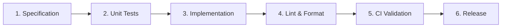

# 📋 System Feature Specifications

This manual catalogs the technical designs, business values, and acceptance criteria for the core features of our platform.

---

## 📂 Feature Index

### 1. Real-Time Bookmaker Odds Scraper
- **Description**: Automatically and asynchronously reads public odds pages to record price changes.
- **Business Value**: Ingests up-to-date prices to compute mathematical value edges before line prices shift.
- **Technical Architecture**: Async Python parsing workers orchestrated by **Celery** and **Redis**. Uses anti-fingerprinting protocols to prevent IP blocks.
- **Acceptance Criteria**: Continuous execution over 72 hours with an error rate below 1%.

### 2. Ensemble ML Outcome Predictor
- **Description**: Generates calibrated match outcome probabilities ($H/D/A$).
- **Business Value**: Provides a reliable benchmark against which to evaluate bookmaker pricing efficiency.
- **Technical Architecture**: Combines LightGBM, XGBoost, and CatBoost outcome probabilities.
- **Acceptance Criteria**: Log-loss score under $0.62$ on out-of-sample matches, with a calibration curve $R^2 > 0.92$.

### 3. Fractional Kelly Portfolio Manager
- **Description**: Computes optimal stake allocations using a fractional Kelly Criterion model to protect capital.
- **Business Value**: Guarantees long-term downside security, preventing exponential capital drawdowns.
- **Technical Architecture**: Relational transaction models with strict constraints.
- **Acceptance Criteria**: Allocation sizes are strictly limited to under 5.0% of total portfolio capital.

---

## 📈 Feature Development Lifecycle

