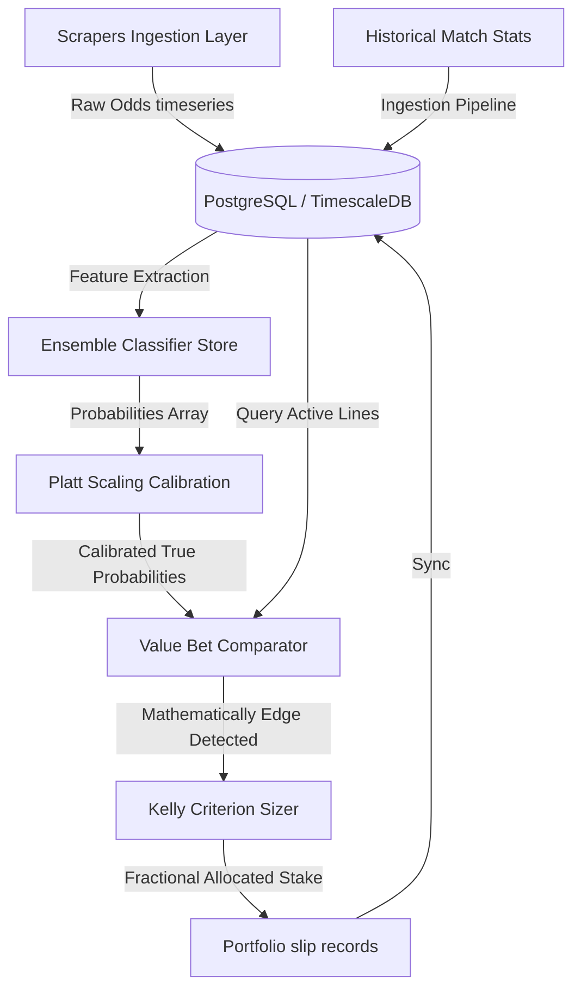

# ⚽ Project Master Definition: AI Betting Intelligence Platform

## 🎯 Mission
To develop the world's most mathematically rigorous, scalable, and secure sports betting analytics platform, operating with the discipline of a quantitative sports arbitrage hedge fund.

## 🔮 Vision
To neutralize bookmaker pricing efficiencies across multiple global sports, starting with Football (Soccer), by deploying calibrated machine learning ensembles that empower users to manage sports prediction indices as systematic investment portfolios.

## 📈 Core Objectives & Business Goals
1. **Mathematical Superiority**: Deliver match outcome predictions with miscalibration rates under 5% across major global soccer leagues.
2. **Systemic Risk Mitigation**: Enforce automated bankroll sizing frameworks to fully guard capital against long-term high-variance streaks.
3. **South Africa Market Compliance**: Build zero-execution, read-only analytics solutions that strictly adhere to regional Bookmaker Terms of Service (Betway SA, Hollywoodbets) by avoiding account-automation.
4. **Sub-second Response Times**: Ensure historical timeseries queries, margin calculations, and portfolio lookups compile under 200ms.

## 🧭 Target Users & Personas
* **Quantitative Sports Analyst (The Quant)**: Demands raw math accuracy, feature importance graphs, and API data access to design individual trading parameters.
* **Systematic Value Bettor (The Portfolio Trader)**: Focuses strictly on historical ROI, cumulative growth charts, bankroll safety buffers, and risk-adjusted drawdowns.
* **Casual Sports Enthusiast**: Seeks clean visual metrics, active match calendars, and simple fractional sizers to track casual stakes securely.

## 🏁 Success Metrics & KPIs
* **Predictive Precision**: Log-loss score under $0.62$ on out-of-sample matches.
* **Risk-Adjusted Return**: Consistent portfolio yield (ROI) exceeding $+4.5\%$ over any 1,000 simulated events.
* **Platform Availability**: 99.9% uptime for the background scrape workers and serving REST gateways.

## 📂 Core Modules
- **Data Ingest Pipeline**: Scheduled scraper workers parsing public tables and processing metrics.
- **ML Scoring Engine**: Classifiers generating calibrated match outcome arrays.
- **Value Betting Module**: Overround-remover comparing prices vs. fair expectations.
- **Portfolio Sizer**: Kelly Criterion calculator clamping stakes to a strict 5.0% single-bet rule.
- **Serving Gateway**: FastAPI controllers exposing JSON REST endpoints.

## 🔗 Related Resources
* Onboarding Guidelines: [START_HERE.md](/START_HERE.md)
* Interactive UI Engine: [src/App.tsx](/src/App.tsx)
* Technical Roadmap: [ROADMAP.md](/ROADMAP.md)
