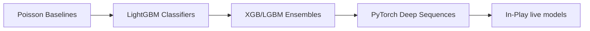

# 🗺️ Technical Engineering Roadmap & Milestones

This document details the quarterly milestones, dependencies, and delivery schedules for the platform.

---

## 📅 Quarterly Engineering Milestones

### 📅 Q3 2026: Core Ingestion & Historical Seeding (Active)
- **Objective**: Deploy resilient bookmaker scraping worker networks and compile historical match results database.
- **Deliverables**: Celery beats schedules, PostgreSQL Timescale schemas, Betway parsing adapters, and automated backtesting databases.
- **Milestones**: Successfully store historical match stats and live odds files for the local South African Premier Soccer League (PSL) and the English Premier League (EPL).

### 📅 Q4 2026: ML Calibrations & Value Search Engine
- **Objective**: Deploy calibrated ensemble models to estimate true outcome probabilities and find pricing gaps.
- **Deliverables**: Feature store compilations, Platt Scaling calibration modules, and overround removal services.
- **Milestones**: Calibrated classifier models producing HDA array percentages, saved as serialized bin files.

### 📅 Q1 2027: Multi-Sport Expansion & Portfolios
- **Objective**: Extend prediction models to Rugby, Cricket, and Tennis alongside interactive portfolio log tools.
- **Deliverables**: Rugby feature set engines, Kelly portfolio controllers, and real-time WebSocket match tickers.
- **Milestones**: Complete unified interactive multi-sport portfolio tracker.

---

## 🛠️ ML & Modeling Roadmap

---

## 🚀 Infrastructure & Scaling Roadmap

- **TimescaleDB Scaling**: Implement database read replica nodes to separate REST API query traffic from live scraper writes.
- **Kubernetes Autoscaling**: Transition scrapers and ML scoring services into autoscaling Kubernetes pods to handle match days across hundreds of leagues.
