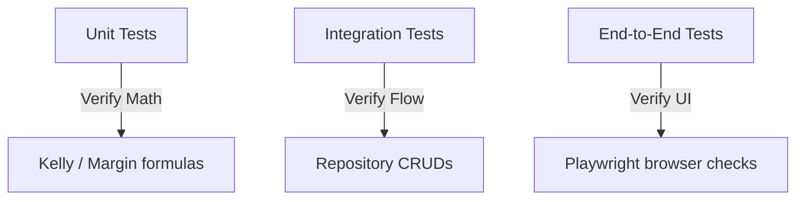

# 🧪 Testing Strategy & Quality Mandates

To guarantee extreme mathematical precision, we enforce strict testing standards across all modules.

---

## 🧪 Unified Test Categories

---

## 📈 Quality & Coverage Standards

- **Minimum Statement Coverage**: The test suite must cover at least **90%** of backend Python statements, with core math modules requiring 100% coverage.
- **Lookahead Bias Detection**: Tests must verify that ML feature stores contain 0 future match data leaks.
- **Continuous Integration Checkpoint**: Pull requests must pass all automated CI linter and test runs before merging.
