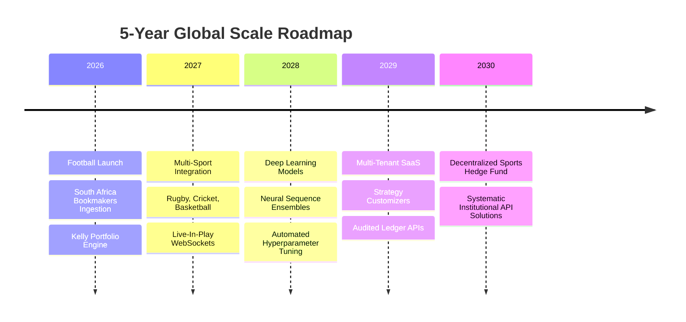

# 🔮 Immersive Long-Term Platform Vision

## 🗺️ 5-Year Enterprise Vision
Our trajectory extends beyond a simple tipping utility. We are building the foundational infrastructure for global **Sports Asset Management**. 

## 🧠 AI-First Engineering Principles
- **Self-Documenting Codebase**: The repository serves as a permanent, living memory. Every algorithm must be accompanied by mathematical proofs and markdown guidelines.
- **No Lookahead Data Leakage**: All training matrices and scoring features must contain rigid chronological separations to ensure future results never leak into past parameters.
- **Calibration Over Raw Output**: Classifiers must prioritize statistical calibration over sheer binary accuracy. An estimate of 55% probability must represent a real-world frequency of exactly 55%.

## 💼 Commercialization & SaaS Strategies
1. **Tiered Subscription Model**:
   - *Bronze*: Basic HDA predictions, standard match calendar tables.
   - *Silver*: Live odds updates, value calculators, basic Kelly portfolios.
   - *Gold (Enterprise)*: API access, custom model weight adjustments, advanced TimescaleDB raw access.
2. **Sports Bookmaker Feed API**: Licensing high-fidelity, overround-stripped "Fair Odds" proxies to international analytics firms.

## ⚖️ Responsible AI Principles
- **Transparency**: Every prediction display includes a detailed feature importance breakdown, showing exactly why the model estimated a specific outcome.
- **No Gambling Encouragement**: The platform enforces a strict Fractional Kelly sizer to restrict aggressive staking and provides clear visual metrics on maximum expected drawdowns.
