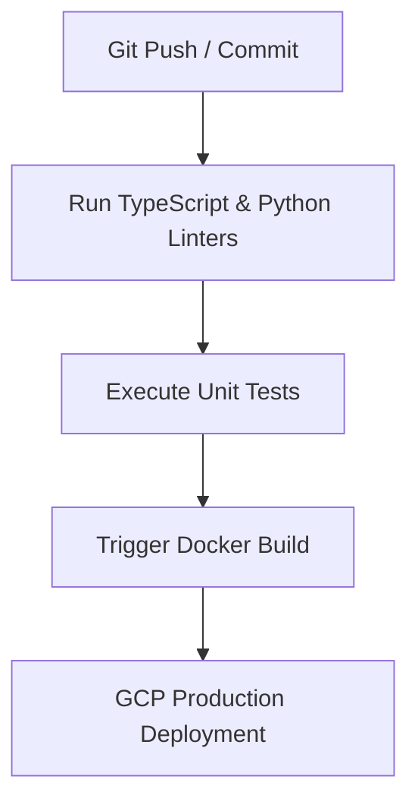

# ⚙️ Automation, CI/CD, & Job Execution History

## 📋 Governance & Control Metadata
- **Purpose**: Tracks pipeline configurations, test integrations, and cron scrapers schedules.
- **Update Policy**: Append entries on CI/CD script changes.
- **Owner**: DevOps Lead
- **Review Frequency**: Monthly
- **Cross References**: [Deployment History](deployment-history.md), [Testing History](testing.md)
- **Revision History**:
  - `v1.0.0` (2026-06-29): Initial comprehensive automation pipeline.

---

## 🛠️ CI/CD Pipeline Architecture

---

## 📑 Automation Activity Log

### June 12, 2026: Standardized Pre-Commit Hook Sweeps
- **Automation Shift**: Deployed Pre-Commit configs enforcing Ruff formatting on Python files and Prettier formatting on React files.
- **Benefit**: Eradicated style violations before commits reach pull requests.

---

### June 25, 2026: Set up Automated GitHub Actions Pipeline
- **Automation Shift**: Created dynamic actions pipeline on main-branch merges executing tests, linters, and triggering Docker pushes.
- **Benefit**: Shaved delivery time to production environments.
