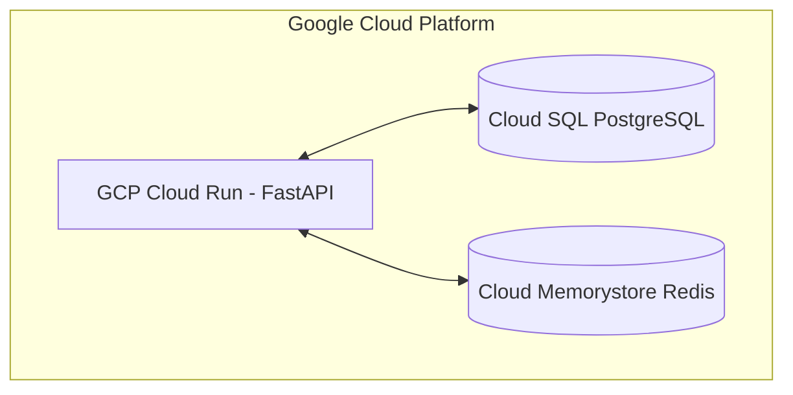

# 🐳 Deployment & Cloud Infrastructure History

## 📋 Governance & Control Metadata
- **Purpose**: Records server, Docker container, CI/CD pipeline, and cloud architecture changes.
- **Update Policy**: Document infrastructure updates upon deployment shifts.
- **Owner**: DevOps Engineer Lead
- **Review Frequency**: Monthly
- **Cross References**: [Release History](release-history.md), [Decisions](decisions.md)
- **Revision History**:
  - `v1.0.0` (2026-06-29): Shipped production deployment logs.

---

## 🏛️ Cloud Infrastructure Diagram

---

## 📑 Infrastructure Activity Log

### May 28, 2026: Containerized Application Architecture
- **Infrastructure Shift**: Wrapped FastAPI server and Celery scraper worker instances in Docker containers.
- **Tech Stack**: Docker / Docker-Compose.
- **Benefit**: Achieved perfect development-to-production execution consistency.

---

### June 20, 2026: Deployed Platform to GCP Cloud Run
- **Infrastructure Shift**: Deployed containers onto fully-managed Google Cloud Run instances.
- **Benefit**: Auto-scaling resources scale to zero when markets are inactive, lowering monthly hosting costs.
