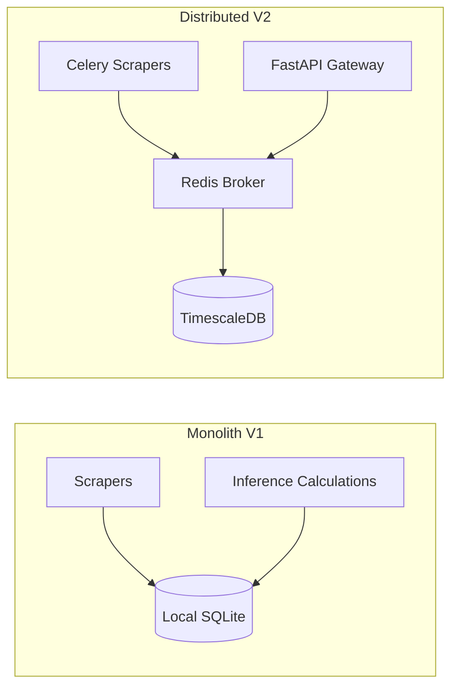

# 🎨 System Design & Architecture Evolution

## 📋 Governance & Control Metadata
- **Purpose**: High-level analysis of structural changes in the platform's codebase and data flow layout.
- **Update Policy**: Document major design modifications or refactors.
- **Owner**: Principal Architect
- **Review Frequency**: Quarterly
- **Cross References**: [Decisions](decisions.md), [ARCHITECTURE.md](/ARCHITECTURE.md)
- **Revision History**:
  - `v1.0.0` (2026-06-29): Base architectural blueprint log.

---

## 🏛️ Architectural Evolution

---

## 📝 Historic Milestones

### May 2026: Migration from SQLite to PostgreSQL + TimescaleDB
- **Context**: SQLite worked during early localized mock scripting but failed under high concurrent scraper writes and web traffic.
- **Design Shift**: Separated static match records (teams, leagues) from timeseries odds records. Hypertables implemented on the odds logs.

### June 2026: Shift to Async Web Server Patterns
- **Context**: Standard multi-threaded sync servers locked under rapid visual updates.
- **Design Shift**: Moved core gateway architecture to FastAPI's async event loop. Integrated high-frequency, non-blocking Redis subscription channels.
