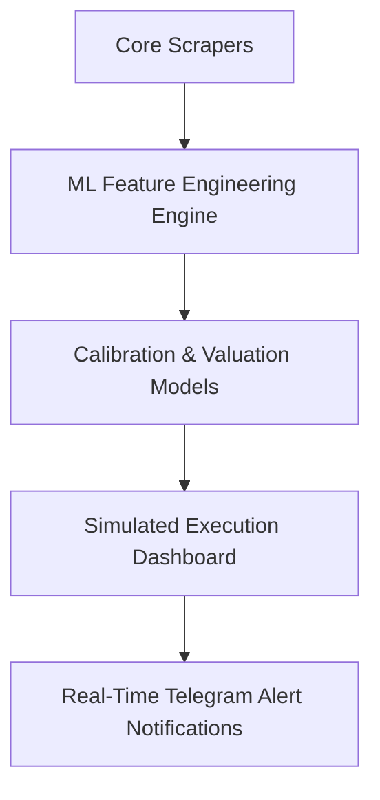

# 🗺️ Feature Evolution & Roadmap History

## 📋 Governance & Control Metadata
- **Purpose**: Product history tracing features from concept, design iterations, shipping, and upgrades.
- **Update Policy**: Document new product developments on release merges.
- **Owner**: Product Owner
- **Review Frequency**: Monthly
- **Cross References**: [Completed Features](completed.md), [Release History](release-history.md)
- **Revision History**:
  - `v1.0.0` (2026-06-29): Shipped feature roadmap history baseline.

---

## 📍 Product Feature Map

---

## 📑 Feature Evolution Log

### Ingestion Scraper Module
- *Phase 1 (May 2026)*: Simple local scraping scripts pushing to SQLite.
- *Phase 2 (June 2026)*: Async Celery worker pipelines running on Redis brokers, feeding TimescaleDB.

### Valuation & Kelly Sizer
- *Phase 1 (May 2026)*: Full-Kelly sizing equation calculations. Too volatile.
- *Phase 2 (June 2026)*: Fractional Quarter-Kelly with strict 5% risk clamping to protect bankrolls.
