# ⚡ System Performance History & Benchmarks

## 📋 Governance & Control Metadata
- **Purpose**: Documents system performance baselines, load testing, and latency history.
- **Update Policy**: Run benchmarks prior to major releases and document the results.
- **Owner**: Performance Engineer / DevOps Lead
- **Review Frequency**: Monthly
- **Cross References**: [Telemetry](logging.md), [Database History](database-history.md)
- **Revision History**:
  - `v1.0.0` (2026-06-29): Shipped release benchmarks.

---

## 📈 System Metrics Timeline

```mermaid
gantt
    title Platform Latency Target SLAs (2026)
    dateFormat  X
    axisFormat %s
    section API Gateway
    HTTP GET Predictions :active, 0, 45
    WebSocket Price Updates : 0, 15
    section Prediction Layer
    Inference Run : 0, 120
    Calibration Platt Scale : 0, 5
```

---

## ⏱️ Historical Benchmarks

### API Response Latencies (p95)
- **Endpoint**: `GET /api/v1/predictions/active`
  - *2026-05-15 (v0.5.0)*: 280ms (Unindexed DB queries)
  - *2026-06-01 (v0.8.0)*: 95ms (Added composite database indexes)
  - *2026-06-29 (v1.0.0)*: **35ms** (Implemented Redis query caching)

### ML Model Execution Metrics
- **Feature Computation Time**: 15.4 seconds (Reduced to 0.8s via Postgres Materialized Views)
- **Ensemble Inference Speed (LGBM + XGB + Cat)**: 120ms total per 1,000 matches.
- **Platt Scaling Calibration**: 2.1ms.

---

## 🗄️ Database Load Tests
- **Simulated Scraper Concurrency**: 15 concurrent scraper instances pushing odds updates simultaneously.
- **Database Write Latency**: Stable at 8.2ms under peak ingestion rates.
- **Redis Get Hit Rate**: 94.2% across UI polling requests.
