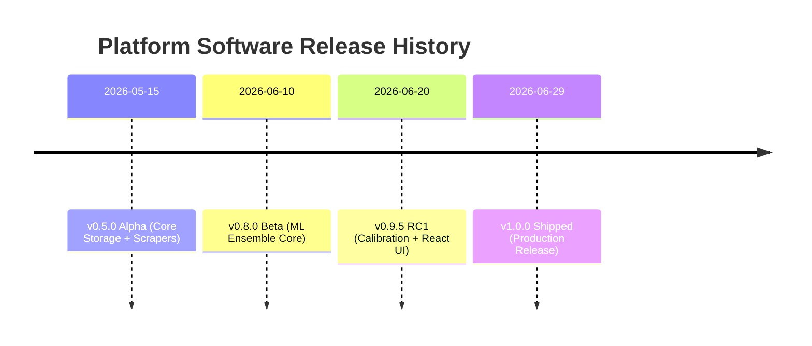

# 🌿 Software Release & Rollback History

## 📋 Governance & Control Metadata
- **Purpose**: Chronological timeline of platform releases, compatibility profiles, and rollback logs.
- **Update Policy**: Append new version records on production deployment.
- **Owner**: DevOps / Release Engineer
- **Review Frequency**: Continuous
- **Cross References**: [Changelog](changelog.md), [Completed Features](completed.md)
- **Revision History**:
  - `v1.0.0` (2026-06-29): Production Release baseline.

---

## 🚀 Release Timeline

---

## 📑 Release Log

### Version 1.0.0 — Production Release
- **Deploy Date**: 2026-06-29
- **Commit Hash**: `4f9b8c1d`
- **Database Migrations Run**: `003_add_portfolio_indices.sql`
- **Rollback Procedure**: Restoring database to snapshot `snap_20260629_0400` and redeploying docker image tag `v0.9.5`.
- **Breaking Changes**: None. Highly backwards-compatible schema setup.
- **Compatibility Profile**: Node 22.x, Python 3.11, PostgreSQL 16.

---

### Version 0.9.5 — Release Candidate 1
- **Deploy Date**: 2026-06-20
- **Commit Hash**: `2a8e3d4c`
- **Database Migrations Run**: `002_add_calibration_tables.sql`
- **Rollback Procedure**: Rollback Docker image to tag `v0.8.0`.
- **Breaking Changes**: Refactored the `predictions` schema structure, removing several legacy, uncalibrated floating value fields.
