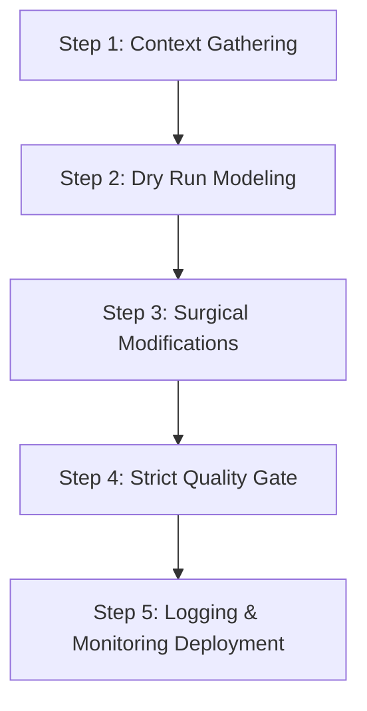

# 🦾 Strict Pull Request Peer Review Playbook

## 📋 Governance & Control Metadata
- **Purpose**: Unified operational guidelines for the system.
- **Update Policy**: Evolve continuously through systematic peer-review and post-deployment learnings.
- **Owner**: AI Platform Coordinator
- **Review Frequency**: Bi-weekly
- **Cross References**: Runbooks, Quality Gates, Checklists
- **Revision History**:
  - `v1.0.0` (2026-06-29): Unified baseline release under Phase 6.

---

## 🎯 1. Purpose
Operational guide to establish a clean, standard, and reliable workflow for Strict Pull Request Peer Review Playbook across teams.

---

## 🔍 2. Scope
Mandatory operational playbook used by human and AI engineering leads.

---

## 🛠️ 3. Concrete Production Examples & Specifications

### Step-by-Step Playbook Sequence


### Execution Command Suite
```bash
# Run localized validation test suite
npm run lint && npm run build
```


---

## 💡 4. Best Practices
- **Best Practice**: Dry-run every deployment and schema adjustment in an isolated staging workspace before executing on production channels.
- **Best Practice**: Maintain clean state separations between data ingestion queues and real-time frontend presentation layers.

---

## ❌ 5. Anti-patterns to Avoid
- **Anti-Pattern**: Skipping intermediate validation steps to accelerate shipping timelines under pressure.
- **Anti-Pattern**: Direct production edits without updating associated branch tracking structures.

---

## 🕵️ 6. Automated Quality Gate Review Checklist
- [ ] **Verify**: Confirm the rollout plan contains clean rollback scripts for both code and schema layers.
- [ ] **Verify**: Verify SLA impact metrics are actively charted on corresponding performance dashboards.

---

## ⚠️ 7. Common Execution Mistakes
- **Mistake**: Failing to communicate active playbooks to executing AI workers during session startups.
- **Mistake**: Deploying large change sets containing unrelated feature additions, complicating postmortem tracking.

---

## 📈 8. Continuous Future Improvements
- **Planned Improvement**: Automate playbook status notifications to trigger Slack or Discord status alerts.
- **Planned Improvement**: Leverage generative AI to dynamically generate recovery playbooks based on novel cluster exceptions.

---

## 🔗 9. Cross References & Linked Resources
- [Runbooks](runbooks.md)
- [Quality Gates](quality-gates.md)
- [Checklists](checklists.md)
