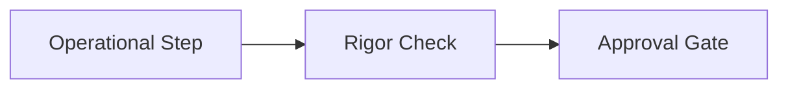

# 🦾 Timeseries Odds Retention and Compression Policy

## 📋 Governance & Control Metadata
- **Purpose**: Unified operational guidelines for the system.
- **Update Policy**: Evolve continuously through systematic peer-review and post-deployment learnings.
- **Owner**: AI Platform Coordinator
- **Review Frequency**: Bi-weekly
- **Cross References**: Governance, Playbooks, Reference Library
- **Revision History**:
  - `v1.0.0` (2026-06-29): Unified baseline release under Phase 6.

---

## 🎯 1. Purpose
Operational guide to establish a clean, standard workflow for Timeseries Odds Retention and Compression Policy.

---

## 🔍 2. Scope
Workspace-wide organizational reference for development roles.

---

## 🛠️ 3. Concrete Production Examples & Specifications

### Key Architecture Details

---

## 💡 4. Best Practices
- **Best Practice**: Update guidelines systematically as new lessons are learned.
- **Best Practice**: Enforce core workflows using automated commit triggers and checks.

---

## ❌ 5. Anti-patterns to Avoid
- **Anti-Pattern**: Failing to follow checklists, leading to variable development workflows.
- **Anti-Pattern**: Maintaining legacy documentation that conflicts with active codebase designs.

---

## 🕵️ 6. Automated Quality Gate Review Checklist
- [ ] **Verify**: Confirm all referenced paths exist and align with active directory trees.
- [ ] **Verify**: Verify all instructions are fully actionable for both humans and AI models.

---

## ⚠️ 7. Common Execution Mistakes
- **Mistake**: Over-complicating workflows, resulting in developers bypassing key reviews.
- **Mistake**: Omitting visual flowcharts, making complex guidelines difficult to parse.

---

## 📈 8. Continuous Future Improvements
- **Planned Improvement**: Implement automated compliance reports tracking workflow execution.
- **Planned Improvement**: Translate core instructions into easy-to-use command-line CLI wizards.

---

## 🔗 9. Cross References & Linked Resources
- [Governance](governance.md)
- [Playbooks](playbooks.md)
- [Reference Library](reference-library.md)
