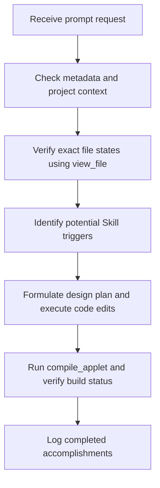

# 🤖 AI Rules & Autonomous Agent Directives

## 1. Purpose
To establish the ultimate operational constitution, behavioral mandates, and quality rules for every AI coding assistant contributing to this repository.

## 2. Scope
Applies to all code generations, edits, planning sequences, reviews, and memory updates made by AI systems.

## 3. Core Principles
- **Read-Before-Write Mandate**: Never modify, add, or delete files without first calling `view_file` to verify their current state.
- **Zero Placeholder Tolerance**: TODO comments, code stubs, or placeholder implementations are strictly banned. Produce 100% complete, production-ready code.
- **Zero-Regression Principle**: Preserve and test existing functionality. Ensure backward compatibility across all integration files.

## 4. Mandatory Rules
- **Onboarding Check**: Always read [START_HERE.md](/START_HERE.md), [README.md](/README.md), and all files inside `.ai/context/` prior to execution.
- **Formulate Design Plan**: For any change request, formulate a maximum 3-bullet plan before starting coding, unless the user requests informational feedback.
- **Verify with Build**: Run `compile_applet` to verify that modifications build successfully. If errors occur, resolve them immediately and compile again (maximum of 3 attempts before stopping).
- **Update Living Records**: Keep logs, changelogs, database records, and rules directories fully updated.
- **HMR WS Warning**: Ignore benign WebSocket connection errors during developer builds.

## 5. Recommended Practices
- Suggest optimizing developer conventions when repetitive patterns emerge.
- Maintain a humble, professional, and scannable communication rhythm.

## 6. Examples

### 🟢 Good AI Planning Sequence
```
1. Read the targeting component.
2. Formulate 3-bullet plan.
3. Apply precise modular modifications.
4. Run compile_applet and confirm build.
5. Summarize the accomplishments.
```

## 7. Anti-patterns & Common Mistakes
- **Stale Context Errors**: Attempting surgical code edits without reading targeting lines first, leading to mismatch failures.
- **Unrequested Feature Bloat**: Adding complex layouts or secondary APIs when only simple single-screen tools are requested.

## 8. Decision Tree: AI Thinking Process


## 9. Review Checklist
- [ ] Were all edited files read prior to modification?
- [ ] Did the assistant formulate a 3-bullet plan?
- [ ] Is the generated code entirely complete and free of TODO placeholders?

## 10. Automation Opportunities
- System contexts automatically inject these rules to guide agent execution.

## 11. Future Improvements
- Refine model alignments to maximize structural compatibility with modular file separations.

## 12. Revision History
- **v1.0.0**: Initial operational directives established.

## 13. Related Documents
- [Prompt Rules](prompt-rules.md)
- [Review Rules](review-rules.md)
