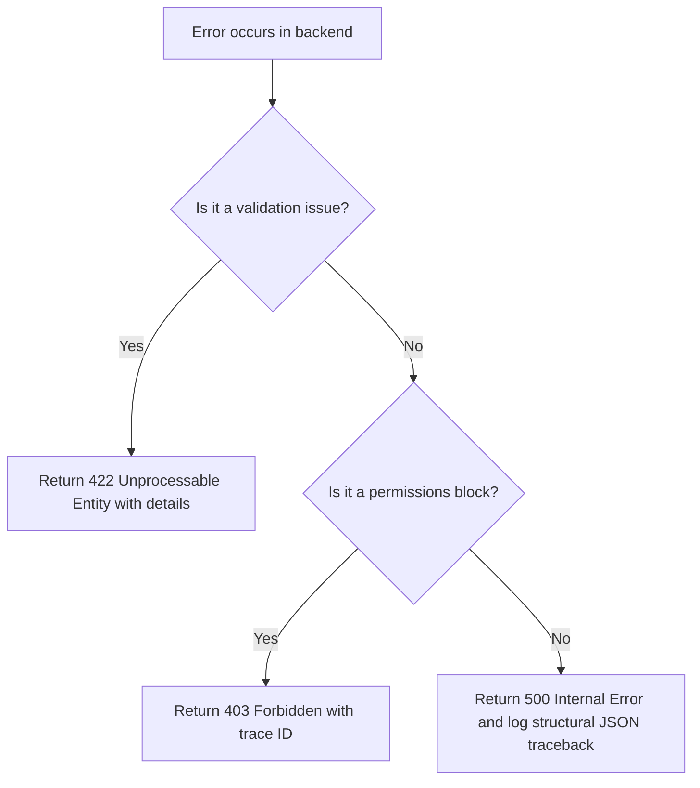

# 🔌 API Rules & Conventions

## 1. Purpose
To ensure robust, predictable, and standardized client-server interfaces.

## 2. Scope
Applies to all REST API routers, parameters, response formats, and WebSocket adapters.

## 3. Core Principles
- **Standard Envelope**: All API responses must utilize the uniform JSON payload envelope.
- **Stateless Authentication**: Rely strictly on crytographically signed JWTs.
- **Backward Compatibility**: Any change to fields must be backward-compatible; else increment version (/api/v2).

## 4. Mandatory Rules
- **Response Format**: Every response must return: `{ success: boolean, data: object, error: object, meta: object }`.
- **HTTP Status Codes**: Use standard codes strictly (200 OK, 201 Created, 400 Bad Request, 401 Unauthorized, 429 Too Many Requests).
- **Idempotency Headers**: API writes handling stakes or slip creation must enforce an `Idempotency-Key` header check.
- **DTO Validation**: Utilize Pydantic schemas in FastAPI to validate incoming JSON structures strictly.

## 5. Recommended Practices
- Limit API response times to under 200ms using caching mechanisms (Redis).
- Provide clean Swagger documentation for all endpoints automatically.

## 6. Examples

### 🟢 Good FastAPI Route
```python
@router.get("/api/v1/predictions/{match_id}", response_model=ApiResponseEnvelope[PredictionDto])
async def get_prediction(match_id: int, service: PredictionService = Depends(get_prediction_service)):
    prediction = await service.get_by_match_id(match_id)
    if not prediction:
        raise HTTPException(status_code=404, detail="Prediction not found")
    return ApiResponseEnvelope(success=True, data=prediction)
```

## 7. Anti-patterns & Common Mistakes
- **Exposing Internal DB Entities**: Directly returning SQLAlchemy models over the API without a Pydantic DTO mapping step.
- **Plain Text Errors**: Returning unstructured traceback strings on 500 server errors.

## 8. Decision Tree: API Error Handling


## 9. Review Checklist
- [ ] Is the response wrapped in the uniform JSON envelope?
- [ ] Are Pydantic schemas used for validation?
- [ ] Is Swagger documentation up-to-date?

## 10. Automation Opportunities
- Automatic schema validation tests validating FastAPI Swagger specs on build.

## 11. Future Improvements
- Migrate core WebSocket servers to specialized streaming adapters to support massive live concurrency.

## 12. Revision History
- **v1.0.0**: Defined REST standards and uniform response envelopes.

## 13. Related Documents
- [Security Rules](security-rules.md)
- [Documentation Rules](documentation-rules.md)
